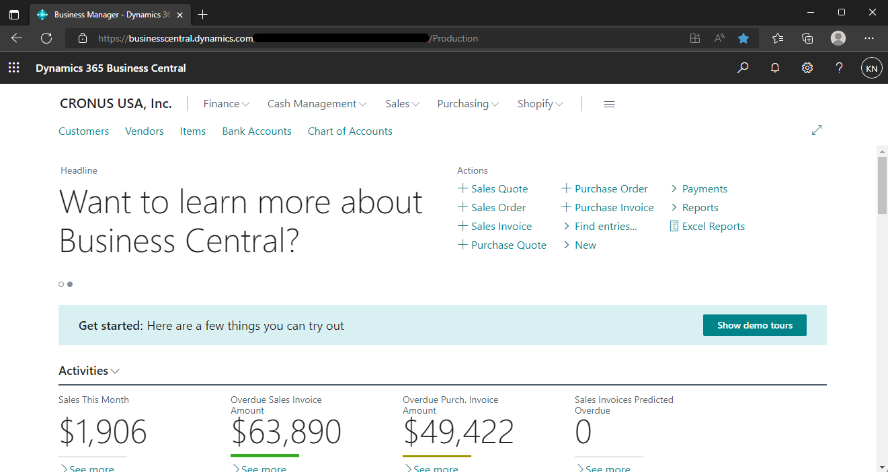
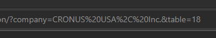
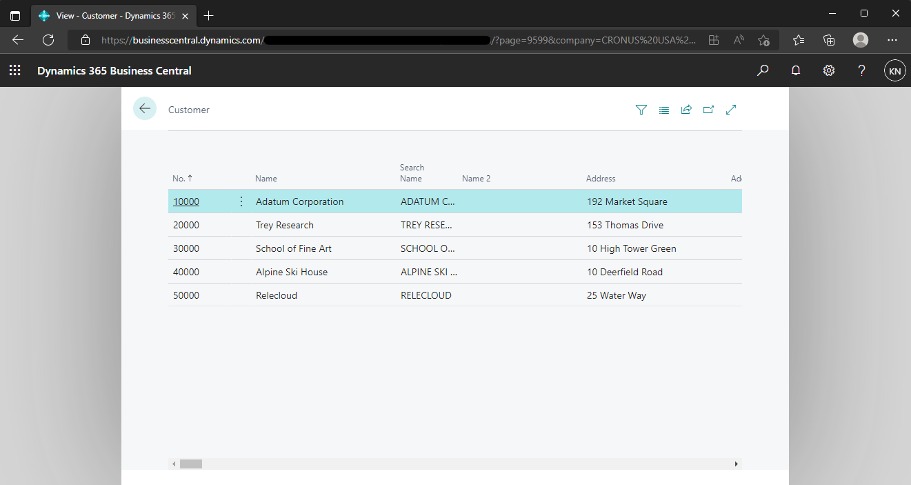
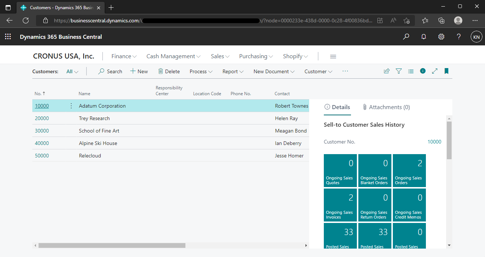
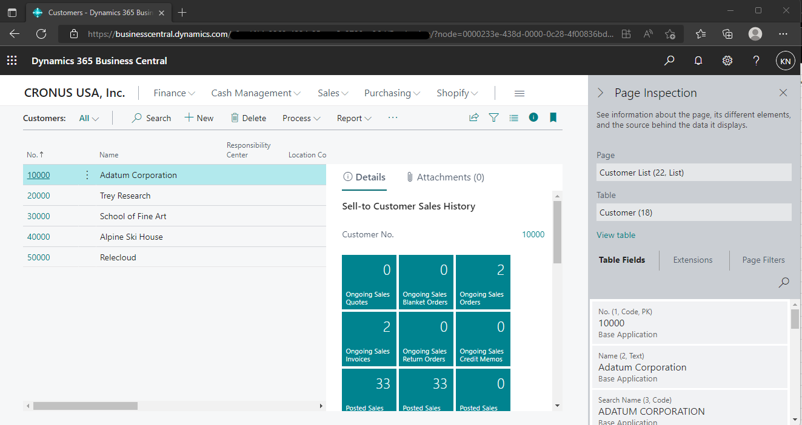

こんにちは、日本マイクロソフトの永吉です。  
この記事では、Dynamics 365 Business Central の画面上で、データベースのテーブルデータを確認する方法を紹介します。

<!-- more -->
## 検証に用いた製品・バージョン
Dynamics 365 Business Central  
Version: W1 20.4  

## 手順
1. D365BC にブラウザでアクセスする
    

2. URL を以下のとおり変更する  
    ``` https://<environmentURL>/?company=<ComapanyName>&table=<tableID> ```  
    以下例  
    

3. 画面上にリスト形式でテーブルデータが表示されます
    

## テーブル番号の調べ方
1. 参照したいテーブルデータが表示されるページに遷移する  
   以下例
    

2. Ctrl + Alt + F1 をクリックして、Page Inspection を開く
    

3. Page Inspection の Table で括弧書きにされている番号がテーブル番号となります  
    

## 注意
上記の手順、手順内の画像については本記事の執筆時のものです。
実際の画面とは挙動に違いがある可能性がございます。

---
## おわりに  

以上、Dynamics 365 Business Central の画面上で、データベースのテーブルデータを確認する方法を紹介いたしました。  
もし、お困りのこと等がございましたら、弊社までお問い合わせ頂きますようお願いいたします。
