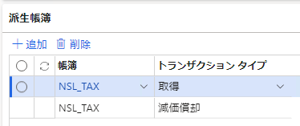
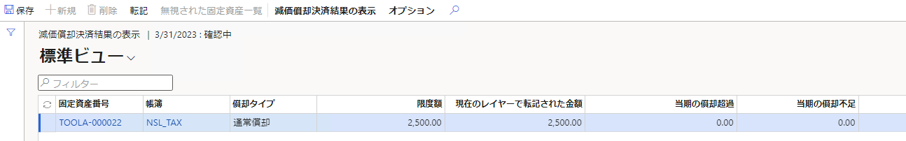

こんにちは、Dynamics ERP サポートチームの尾崎です。  
この記事では、Dynamics 365 Finance and Operations (D365FO) の日本向けローカライゼーション機能である固定資産別表 16 シリーズの作成に必要な設定手順を紹介します。  
<!-- more -->
## 検証に用いた製品・バージョン:
Dynamics 365 Finance and Operations  
Application version: 10.0.27  
Platform version: PU51 

# 減価償却決済ルールの設定

会計帳簿と税務上想定される金額の間で減価償却額に差額が発生した場合の取り扱いを規定します。手順は以下のようになります。
1. 固定資産＞設定＞減価償却決済ルールを開く
2. 初回起動時には"既定のルールをインポートしますか？"というメッセージが表示されるので OK を選択
3. インポートに成功すると設定画面に表示

# 帳簿の設定

固定資産帳簿にて会計帳簿と税務帳簿の設定を行います。手順は以下のようになります。
1. 固定資産＞設定＞帳簿を開く
2. 転記階層＝税申告の帳簿を選択し、参照される帳簿に税務帳簿と紐づけたい転記階層＝現行の会計帳簿を選択

# 派生帳簿の設定

固定資産帳簿にて派生帳簿を設定し、会計帳簿を転記した際に自動で税務帳簿も転記されるように設定を行います。この設定は任意です。手順は以下のようになります。
1. 固定資産＞設定＞帳簿を開く
2. 派生帳簿を開き、税務帳簿の設定を追加

# 固定資産の作成、取得、減価償却の転記

固定資産の作成と取得、減価償却費の転記を行います。派生帳簿の設定を行っている場合には会計帳簿を転記することで税務帳簿まで転記することが可能です。

# 償却超過/償却不足額の決済
        
帳簿間の取得金額・償却金額の差異を計算します。
1. 固定資産＞定期処理のタスク＞償却超過/償却不足額の決済を開く
2. +新規ボタンを押下し、パラメーターとレコードを選択して実行
   1. パラメーターの終了日は会計年度の終了日を選択
3. データの取得に成功すると一覧に表示されるので、決済結果の表示から結果を確認
4. 決済結果に問題がなければそのまま転記を実行

# 別表 16 の出力

決済完了後、別表 16 を出力します。別表 16-1 レポートの出力例は以下のようになります。
1. 固定資産＞照会およびレポート＞法人税別表 16 シリーズ＞別表 1 レポートを起動
2. パラメーターとレコードを選択して実行

(参考URL)  
[派生帳簿](https://docs.microsoft.com/ja-jp/dynamics365/finance/fixed-assets/derived-books)  
[派生帳簿を転記する](https://docs.microsoft.com/ja-jp/dynamics365/finance/fixed-assets/post-derived-value-models)  
[償却超過額/償却不足額の定期決済](https://docs.microsoft.com/ja-jp/dynamics365/finance/localizations/tasks/periodic-settlement-over-under-depreciation)
[(JPN) 固定資産レポートの生成](https://docs.microsoft.com/ja-jp/dynamicsax-2012/appuser-itpro/jpn-generate-fixed-assets-reports)

# おわりに  
以上、固定資産別表 16 シリーズの事前設定と出力の手順についてご紹介しました。
より詳細な情報が必要な場合、弊社テクニカルサポート、Customer Success Account Manager (CSAM), Customer Engineer (CE) までお問い合わせください。
