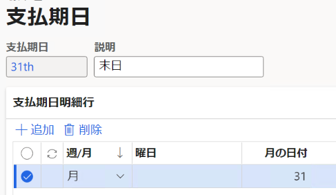
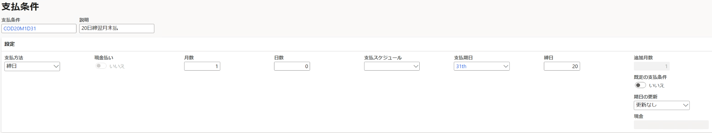
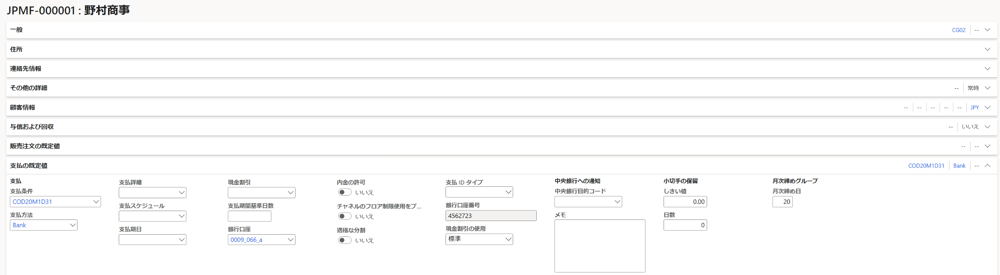
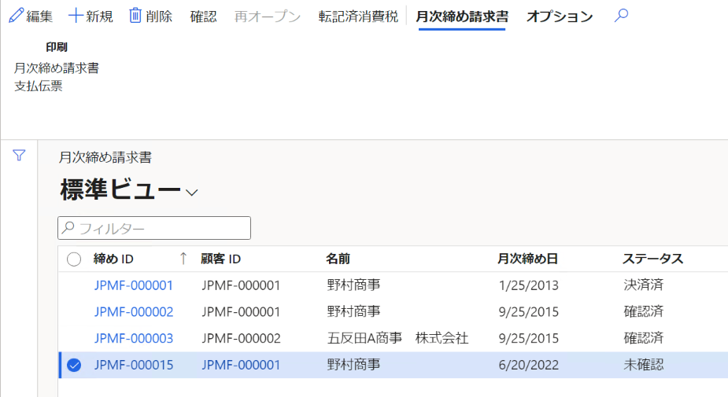

こんにちは、Dynamics ERP サポートチームの尾崎です。  
この記事では、Dynamics 365 Finance and Operations (D365FO) の日本向けローカライゼーション機能である月次締め請求書作成手順を紹介します。  
<!-- more -->
## 検証に用いた製品・バージョン
Dynamics 365 Finance and Operations      
Application version: 10.0.25
Platform version: PU49

# 支払期日の設定

請求書に記載する毎月の支払予定日の情報を入力します。手順は以下のようになります。
1. 売掛金管理＞支払の設定＞支払期日を開く
2. +新規ボタンを押下し、支払期日の名称を入力
3. 支払期日明細行では"週/月"に"月"を入力、"月の日付"には毎月の期日を入力（毎月の支払日に末日を設定する場合には31を入力）

# 支払条件の設定

月次締め請求書における締日などの支払い条件を登録します。手順は以下のようになります。
1. 売掛金管理＞支払の設定＞支払条件を開く
2. +新規ボタンを押下し、支払条件の名称を入力、支払方法には"締日"を選択
3. 月数には当月、翌月、翌々月などの情報を数字で入力（20日締翌月末払いの場合、締日に20、月数に1を入力）

# 月次締めグループの登録

月次締め請求書出力時に使用する顧客の月次締め日を登録します。手順は以下のようになります。
1. 売掛金管理＞顧客＞すべての顧客を開く
2. 対象の顧客を選択し、支払の既定値＞月次締め日に顧客の月次締め日を入力
3. 支払条件についても作成したものを入力

# 販売注文の作成

販売注文は通常の手順で作成したものを使用できます。月次締め日を登録した顧客について販売注文を作成し転記まで行います。

# 月次締め請求書の出力
        
月次締め請求書の出力は以下の手順になります。
1. 売掛金管理＞定期処理のタスク＞月次締め請求書を開く
2. +新規ボタンを押下し、パラメーターとレコードを選択して実行
   1. パラメーターの実行日はセッション日付
   2. 月次締め日を手動で設定したい場合、 "以下で指定する月次締め日の使用" を "はい" に変更
3. データの取得に成功すると一覧に表示されるので、データを選択した状態で月次締め請求書＞月次締め請求書ボタンより印刷
4. 出力結果について確定する場合は確認ボタンを押下（確認済のものを変更する場合は再オープンを押下する）

(参考URL)  
[顧客月次締め請求書の作成および確認](https://docs.microsoft.com/ja-jp/dynamics365/finance/localizations/tasks/create-confirm-customer-consolidated-invoice)  
[日本向け月次締め請求書](https://docs.microsoft.com/ja-jp/dynamics365/finance/localizations/apac-jpn-consolidate-invoices)  

# おわりに  
以上、月次締め請求書の事前設定と出力の手順についてご紹介しました。
より詳細な情報が必要な場合、弊社テクニカルサポート、Customer Success Account Manager (CSAM), Customer Engineer (CE) までお問い合わせください。
