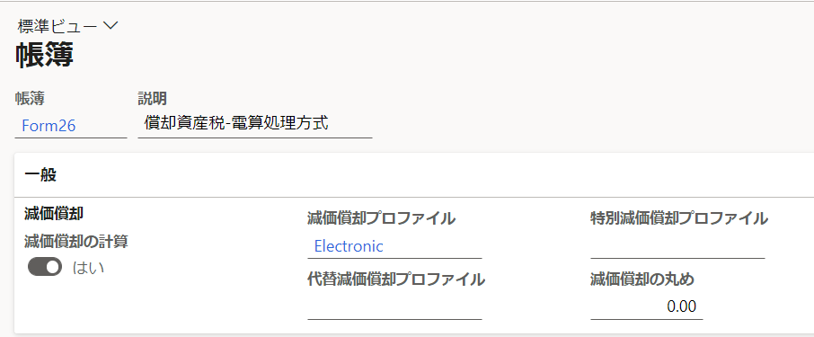
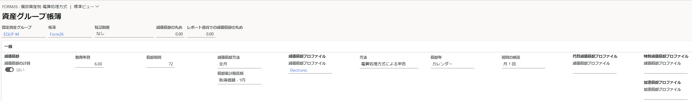

こんにちは、Dynamics ERP サポートチームの尾崎です。  
この記事では、Dynamics 365 Finance and Operations (D365FO) の日本向けローカライゼーション機能である償却資産申告書の作成に必要な設定手順を紹介します。
<!-- more -->

# 検証に用いた製品・バージョン

Dynamics 365 Finance and Operations
Application version: 10.0.29
Platform version: PU53

# 機能管理の設定

機能管理にて "(日本) 減価償却資産申告レポートの計算には資産減価償却率を使用します。" を有効にします。手順は以下のようになります。
1. システム管理＞ワークスペース＞機能管理を開く
2. "(日本) 減価償却資産申告レポートの計算には資産減価償却率を使用します。" を選択し、有効化

# 帳簿の設定

固定資産帳簿にて償却資産税申告用の帳簿を設定します。手順は以下のようになります。
1. 固定資産＞設定＞帳簿を開く
2. 減価償却プロファイル＝Electronicの帳簿を選択

3. 固定資産グループを開き、帳簿に紐づく固定資産グループを追加

# 固定資産の作成、取得、減価償却の転記

固定資産の作成と取得、減価償却費の転記を行います。会計帳簿や税務帳簿に加え、今回追加した償却資産税申告用の帳簿についても転記を行います。

# 償却資産税申告書の出力
        
償却資産税申告書を出力します。レポートの出力例は以下のようになります。
1. 固定資産＞照会およびレポート＞減価償却資産申告レポート＞申告26:償却資産税の元帳レポートを起動
2. パラメーターとレコードを選択して実行
   1. 暦年＝出力対象年を選択
   2. 登録番号＝法人または事象所に紐づく税務登録番号を選択（組織管理＞組織＞法人＞住所＞詳細オプション＞詳細より確認可能）
   3. 事業所用家屋資産番号＝事業所に該当する固定資産を選択

"申告26-1:全資産および増加資産のタイプごとの詳細レポート", "申告26-2:減少資産のタイプごとの詳細レポート" より
増加資産や減少資産の種類別明細書についても出力することが可能です。

(参考URL)  
[(JPN) 固定資産レポートの生成](https://docs.microsoft.com/ja-jp/dynamicsax-2012/appuser-itpro/jpn-generate-fixed-assets-reports)

# おわりに  
以上、償却資産申告書の事前設定と出力の手順についてご紹介しました。
より詳細な情報が必要な場合、弊社テクニカルサポート、Customer Success Account Manager (CSAM), Customer Engineer (CE) までお問い合わせください。
