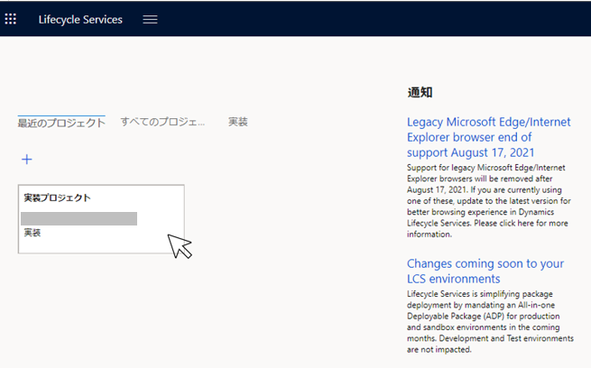
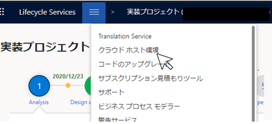
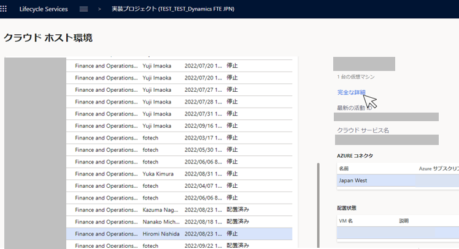
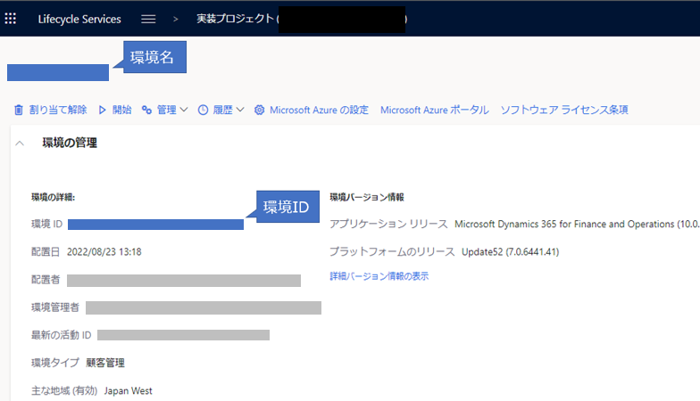

こんにちは、Dynamics ERP サポートチームの西田です。  
私たちサポートチームにお問い合わせいただいた際、調査のために"環境名・環境IDをお教えください"とご依頼させていただくことがあります。
この記事では、環境名・環境ID取得についてご紹介します。  
<!-- more -->

# 環境名・環境IDとは？
環境名・環境IDとは、下記画像の箇所のことを指します。

# 環境名・環境IDの取得方法
1. Lifecycle Services(https://lcs.dynamics.com/) を開き、対象の実装プロジェクトを選択
   

2. 画面右上の三本線をクリックし、「クラウドホスト環境」を選択
   

3. 画面左側に表示される環境一覧の中から対象の環境を選び、「完全な詳細」を選択
   

4. 遷移先の画面の以下の箇所が環境名・環境IDです。
   

# おわりに  
以上、環境名・環境ID取得についてご紹介しました。
より詳細な情報が必要な場合、弊社テクニカルサポート、Customer Success Account Manager (CSAM), Customer Engineer (CE) までお問い合わせください。

