こんにちは、日本マイクロソフト Dynamics ERP サポートチームの道浦です。  
この記事では、 Dynamics 365 Finance and Operations にて、 顧客の一時的な与信限度額の登録に必要な手順を紹介します。

<!-- more -->
## 検証に用いた製品・バージョン
Dynamics 365 Finance and Operations      
Application version: 10.0.29  
Platform version: PU53  

## 顧客の一時的な与信限度額の登録手順

1. Finance and Operations のホーム画面を起動する

2. 与信および回収 > 与信限度額の調整 > 与信限度額の調整の順にクリックする
    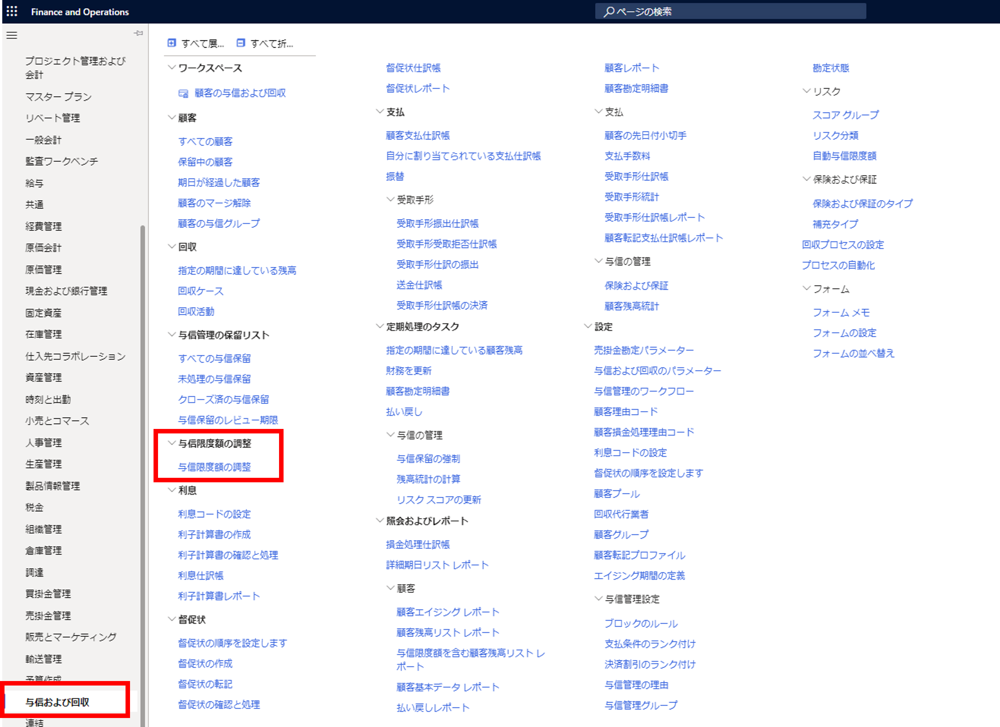

3. 「+ 新規」をクリックし、与信限度額タイプを「一時的な与信限度額」に設定する
    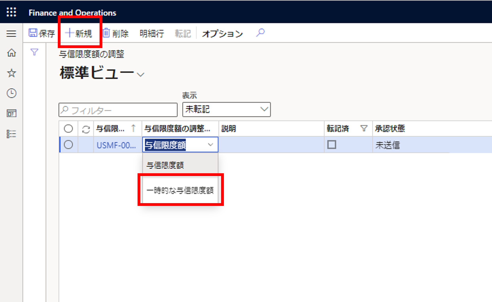

4. 明細行タブをクリックし、明細行画面へ遷移する
    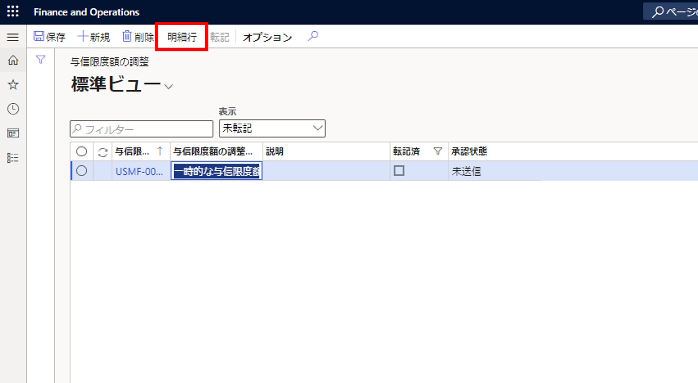

5. 「顧客ID」、「新しい与信限度額」、「新しい開始日」および「有効期限」を入力する  
    入力後、「保存」と「転記」をクリックする
   　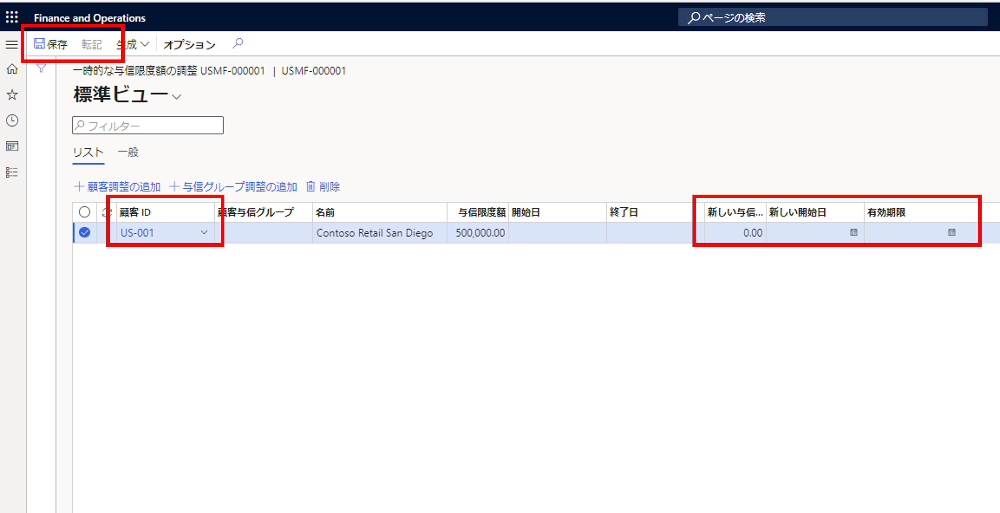

## 登録した一時的な与信限度額の確認方法

6. ホーム画面のカレンダーからセッション日時を与信限度の新しい開始日に設定した日付に設定する

7. 売掛金管理 > 顧客 > すべての顧客の順にクリックする
 　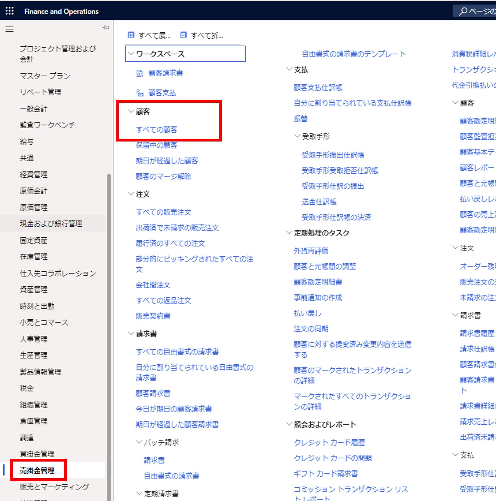

8. 手順5にて選択した顧客 ID を選択する  
    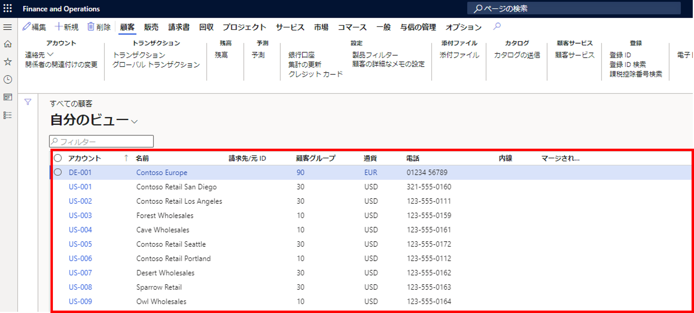

9. 「与信および回収」の「一時的な与信限度額」と「合計与信限度額」が指定した金額になっていることを確認できる   
    また、一時的な与信限度額の有効期限内の場合は、古い与信限度額から新しい与信限度額に一時的に更新される
    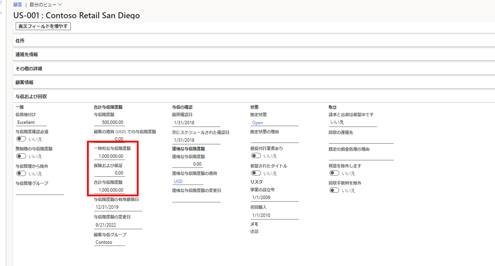

## 顧客画面からの一時的な与信限度額の登録及び確認方法
顧客画面からでも一時与信限度額の登録及び確認することが可能です。
* 登録方法
10. 対象の顧客 ID を選択し、「与信の管理」タブの「与信限度額の調整」をクリックする
    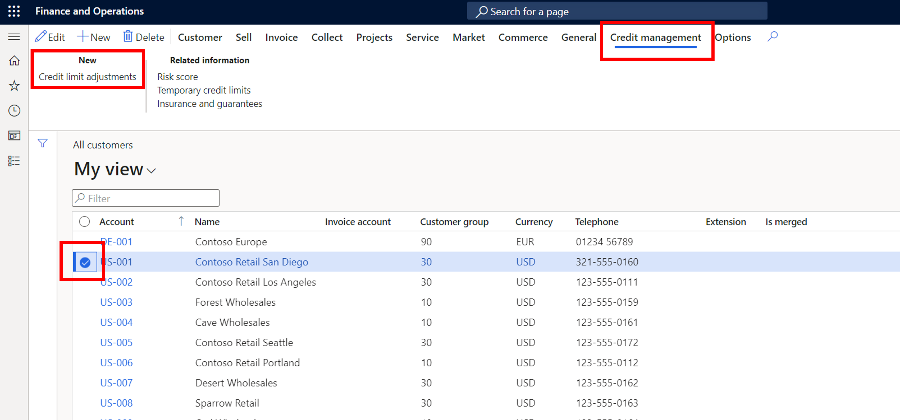

11. 上記の手順2を実施した時の画面が表示されるため、手順3以降を実施して一時与信限度額を登録する

* 確認方法
12. 対象の顧客 ID を選択し、「与信の管理」タブの関連情報内の「一時的な与信限度額」をクリックする
    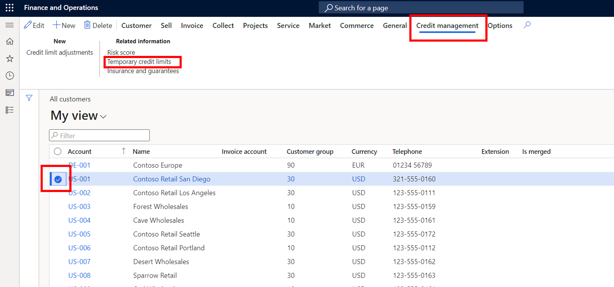

13. 対象の顧客 ID の一時的な与信限度額を確認する
    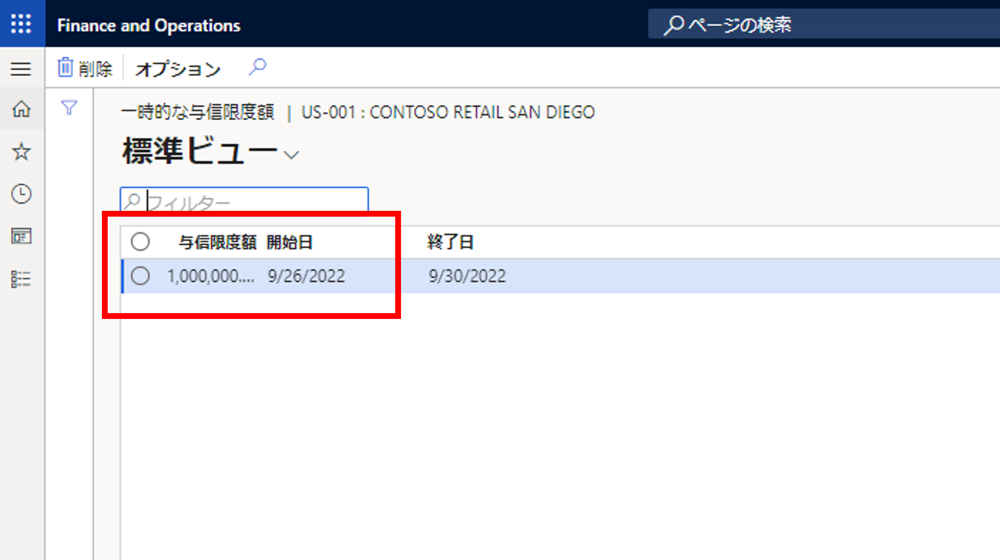

## 与信限度額設定後の警告メッセージについて
当該与信限度額を超える場合、販売注文を確認する際に、以下の通り警告メッセージが表示されます。
    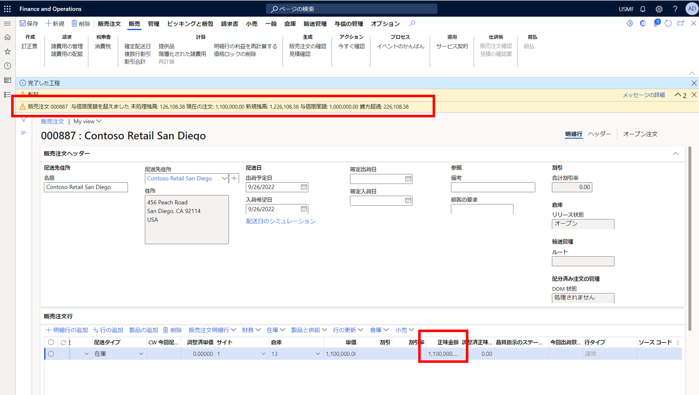

警告の解消方法については下記のリンクをご参照ください。  
https://jpdynamicserp.github.io/blog/D365FO%20App%20SCM/how-to-resolve-warning-when-confirm-sales-order/#more

---
## おわりに  

以上、顧客の一時的な与信限度額の登録に必要な手順についてご紹介しました。
より詳細な情報が必要な場合、弊社テクニカルサポート, Customer Success Account Manager (CSAM), Customer Engineer (CE) までお問い合わせください。
