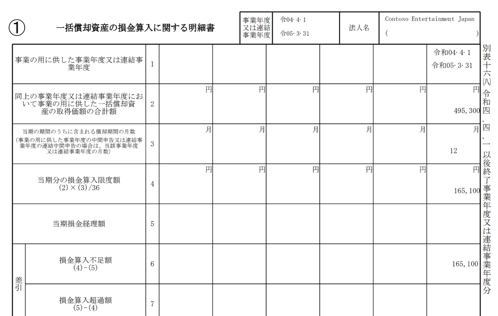
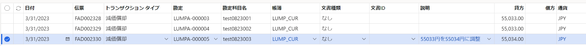

こんにちは、Dynamics ERP サポートチームの尾崎です。  
この記事では、Dynamics 365 Finance and Operations (D365FO) の日本向けローカライゼーション機能である一括償却資産の償却について、
総額から算出した当期の償却額を転記する手順を紹介します。
2022年8月現在このシナリオはサポートされておらず、償却提案時には各一括償却資産から個別に算出された償却額を積み上げた値が提案されております。
例えば、165,100円の固定資産が3つ登録されている場合、総額から算出すると165,100円となりますが、各資産の償却額を積み上げた場合、165100 / 3 ≒ 55033 * 3 = 165,099となり1円のズレが生じます。

本記事はバージョン10.0.27を使用して作成しております。
<!-- more -->

# 固定資産の作成、取得

一括償却資産の作成と取得を行います。

# 当期分の損金算入限度額の確認

別表16-8レポートを出力し、当期の損金算入限度額を確認します。別表16-8レポートの出力方法は以下のようになります。
1. 固定資産＞照会およびレポート＞法人税別表16シリーズ＞別表8レポートを起動
2. パラメーターを選択して実行
一括償却資産の取得価額の合計額(項目2)より算出された当期の損金算入限度額(項目4)を確認します。

# 償却提案の作成
        
当期の償却提案を行います。
1. 固定資産＞仕訳入力＞固定資産仕訳帳を起動
2. ＋新規より減価償却用の仕訳行を作成後、明細行をクリック
3. 提案＞償却提案より固定資産グループ等の条件を使用して一括償却資産に対象を絞り、償却提案を実行
4. 作成された減価償却金額と、確認した当期分の損金算入限度額の差額を調整
調整を行った対象を追跡可能とするため、説明欄に調整内容等を記載します。
   

# おわりに  
以上、一括償却資産の減価償却手順における調整手順についてご紹介しました。
一括償却資産の総額から当期の償却額を算出する方法について現在弊社にて修正を検討中でございます。

より詳細な情報が必要な場合、弊社テクニカルサポート、Customer Success Account Manager (CSAM), Customer Engineer (CE) までお問い合わせください。
