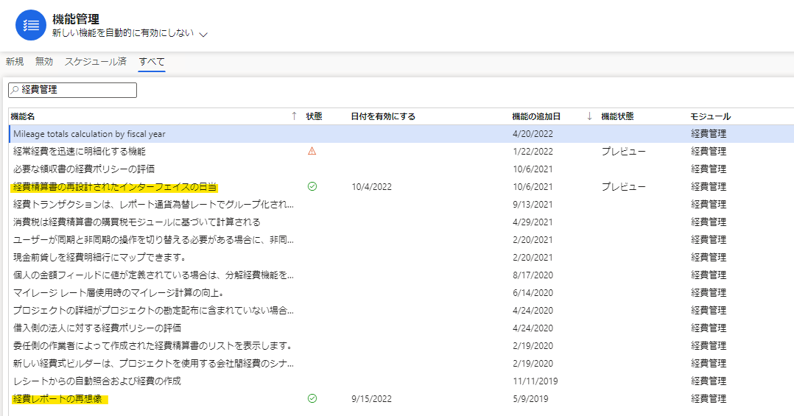
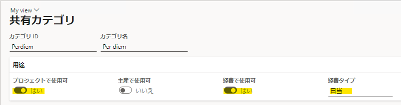
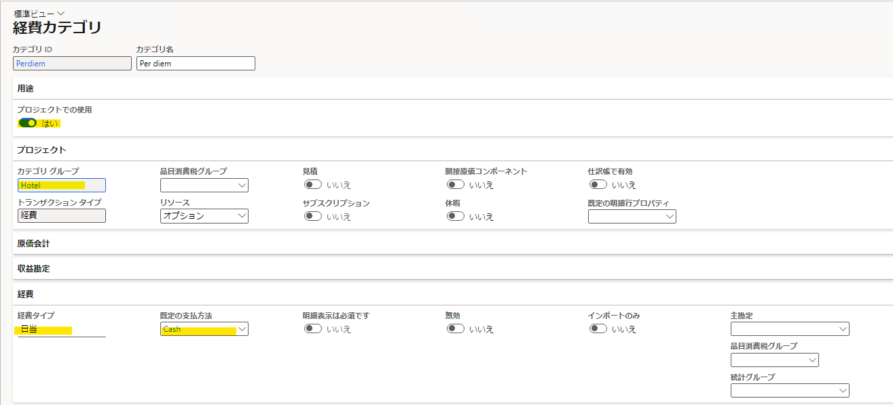
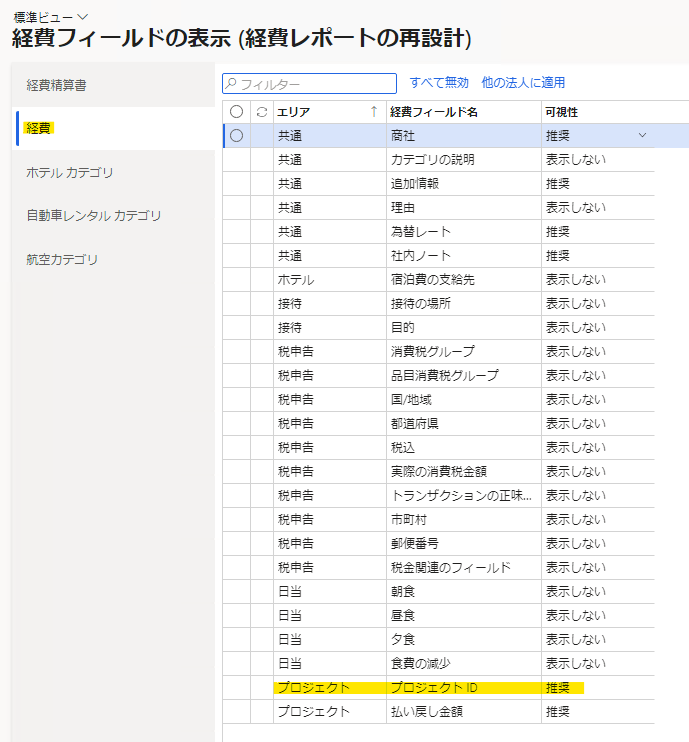
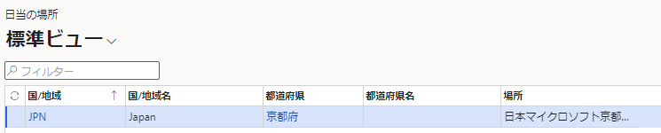
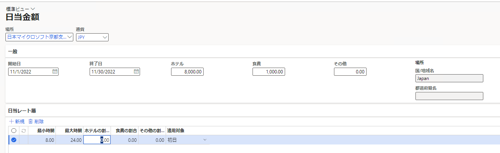
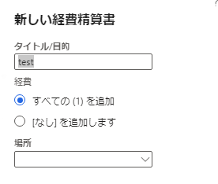
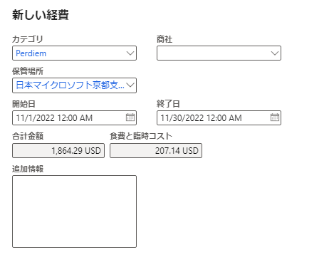
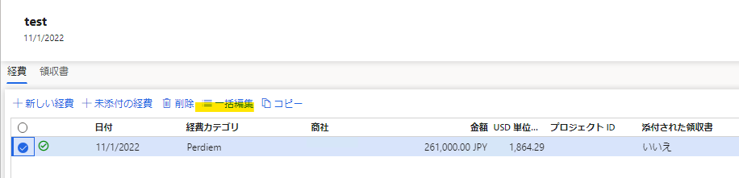
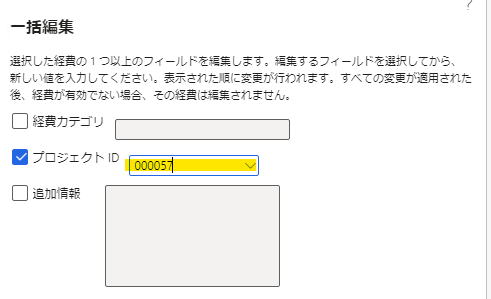

こんにちは、Dynamics ERP サポートチームの西田です。  
この記事では、ワークスペース「経費管理」から特定のプロジェクトに経費カテゴリ「日当」を紐づける方法ついてご紹介します。  
<!-- more -->

# 手順詳細
**1. 機能管理にて「経費レポートの再想像(Expense reports re-imagined)」「経費精算書の再設計されたインターフェイスの日当(Per-diem for expense report re-imagined)」を有効化**
経路: ワークスペース>機能管理
以下2つの機能を有効化してください。
   

**2. 共有カテゴリ(Shared categories)の作成**
経路: モジュール>経費管理>設定>全般>共有カテゴリ
「新規」から経費タイプ「日当」の共有カテゴリを作成してください。(すでに既存のカテゴリがある場合はそちらをご利用いただくことも可能です)
その際、「プロジェクトで使用可」「経費で使用可」にチェックを入れてください。
   

**3. 経費カテゴリ(Expense categories)の作成**
経路: モジュール>経費管理>設定>全般>経費カテゴリ
「新規」からカテゴリIDに手順2で作成したカテゴリIDを使用した経費カテゴリを作成してください。(すでに既存のカテゴリがある場合はそちらをご利用いただくことも可能です)
その際、「プロジェクトでの使用」にチェックを入れ、必須項目「カテゴリグループ」「既存の支払方法」を入力してください。
   

**4. 経費フィールドの表示 (経費レポートの再設計) (Expense fields visibility (Expense reports re-imagined))の設定**
経路: モジュール>経費管理>設定>全般>経費フィールドの表示 (経費レポートの再設計)
「経費」タブから「プロジェクトID」を「推奨」にしてください。
   

**5.日当の場所(Per diems)の作成**
経路: モジュール>経費管理>設定>計算とコード>日当の場所
「新規」から日当の場所を作成してください。

   

**6.日当金額(Per diem amounts)の作成**
経路: モジュール>経費管理>設定>計算とコード>日当
「新規」から場所に手順5で作成した場所を選んで日当金額を作成してください。

   

**7. 経費の作成**
経路: モジュール>経費管理>ワークスペース>経費管理
「新しい経費精算書」から新しい経費精算書を作成し、「新しい経費」から詳細情報を入力してください。(このとき、カテゴリは手順3で作成したカテゴリを指定し、日付は手順6で作成した日当の開始日・終了日内に含めてください)

   
   

**8. 「一括編集」からプロジェクトIDを設定し、「保存して続行」を押下してください。**

   
   

   これにて経費とプロジェクトの関連付けが完了です。

# おわりに  
以上、ワークスペース「経費管理」から特定のプロジェクトに経費カテゴリ「日当」を紐づける方法ついてご紹介しました。
より詳細な情報が必要な場合、弊社テクニカルサポート、Customer Success Account Manager (CSAM), Customer Engineer (CE) までお問い合わせください。

