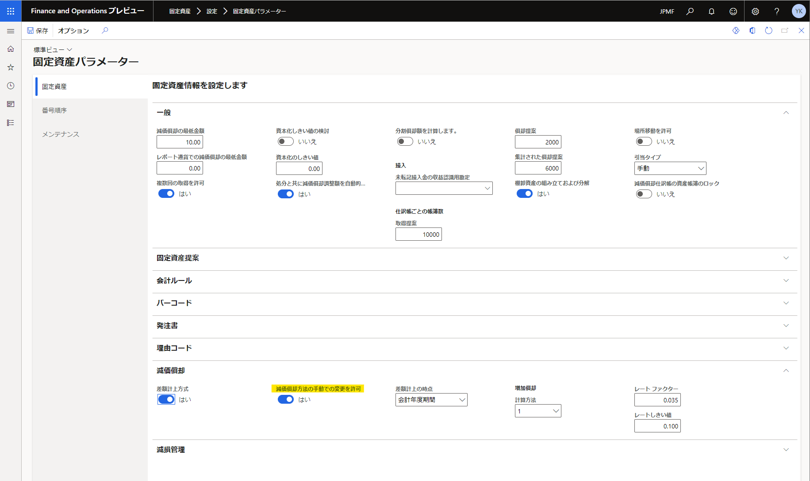
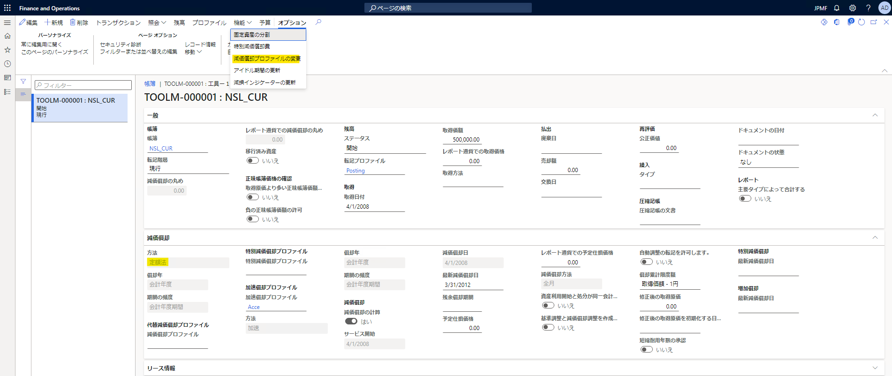
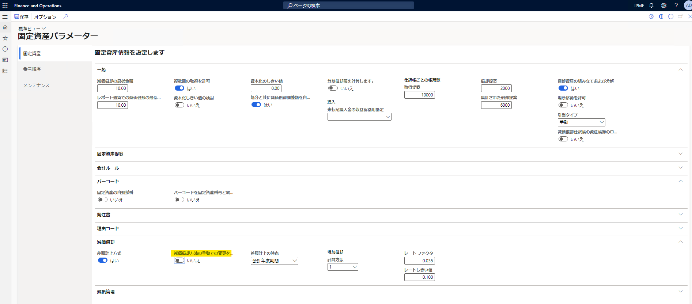
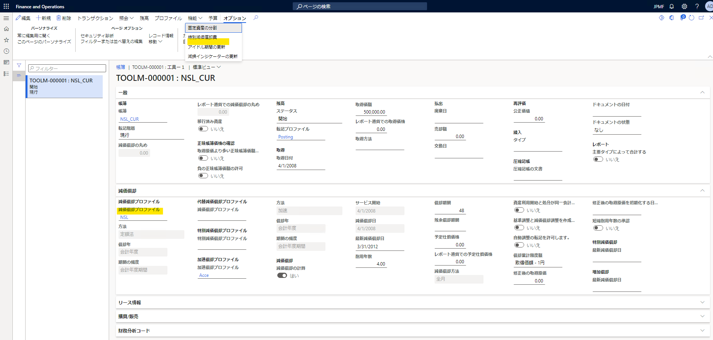

こんにちは、Dynamics ERP サポートの木村です。  
この記事では、固定資産の帳簿に減価償却プロファイルの変更機能を表示する方法についてご案内いたします。  

<!-- more -->
パラメータの適用方法、動作につきましては以下をご覧ください。  

## 固定資産の帳簿にて減価償却プロファイルの変更を表示する方法
### 「減価償却方法を手動での変更を許可」を**はい**に変更した場合
1. JPMFにて確認
1. 固定資産 > 設定 > 固定資産パラメーターを開く
1. 減価償却タブを開く
1. 「減価償却方法を手動での変更を許可」を**はい**に変更し、保存する

1. 固定資産 > 固定資産 > 固定資産を開く 
1. 任意の固定資産を開き、帳簿を押下する
1. 機能 > 減価償却プロファイル
**-> 減価償却プロファイルの変更が表示される**

***  

### 「減価償却方法を手動での変更を許可」を**いいえ**に変更した場合

1. 固定資産 > 固定資産 > 固定資産を開く 
1. 任意の固定資産を開き、帳簿を押下する
1. 機能 > 減価償却プロファイル
**-> 減価償却プロファイルの変更が表示されない**

## おわりに
---
以上、固定資産の帳簿に減価償却プロファイルの変更機能を表示する方法についてご紹介しました。  
減価償却プロファイルを変更する際にご利用ください。
