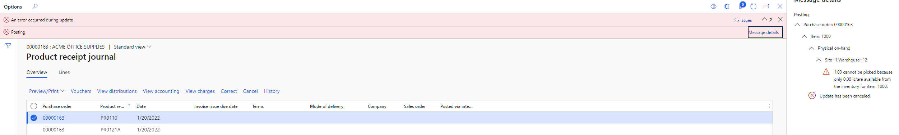
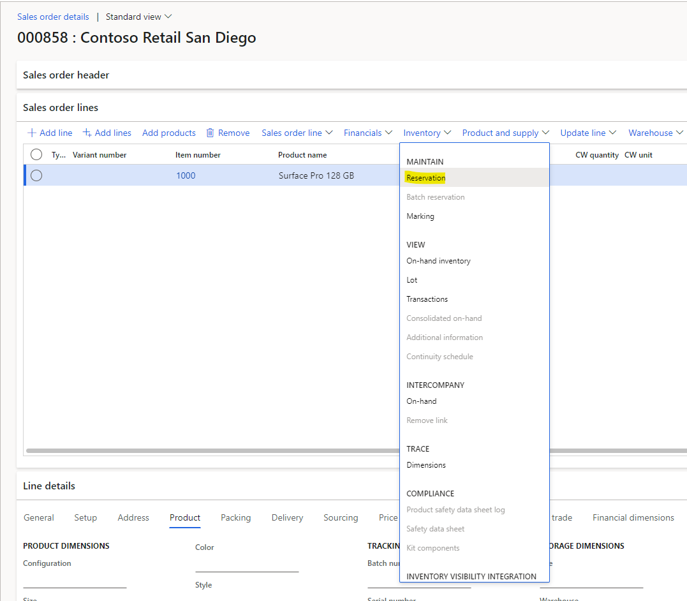
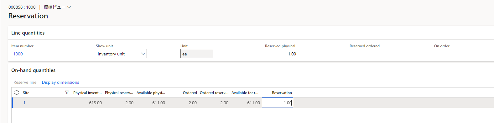
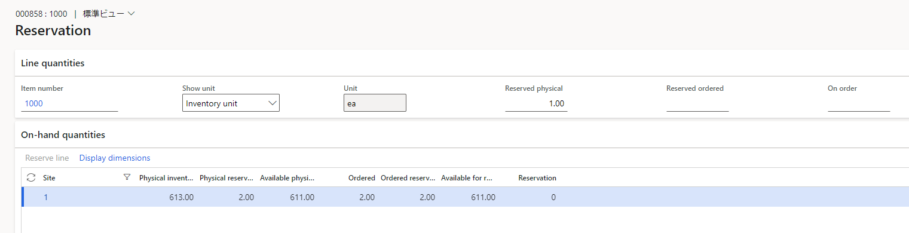
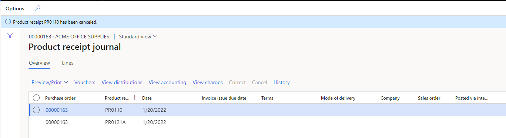

こんにちは、Dynamics ERP サポートの木村です。  
この記事では、販売注文に紐づく発注書の製品受領書のキャンセル方法についてご案内いたします。  

<!-- more -->
## 検証に用いた製品・バージョン:
Dynamics 365 Finance and Operations  
Application version: 10.0.25  
Platform version: PU49 

販売注文に紐づく発注書の製品受領書のキャンセル方法につきましては以下をご覧ください。  

## 販売注文に紐づく発注書の製品受領書のキャンセル方法
下記エラーメッセージが表示された際のキャンセル方法についてご案内いたします。
> 1.00 cannot be picked because only 0.00 is/are available from the inventory for item: 1000.
>
> 日本語：品目1000の在庫から0.00しか利用できないため、1.00をピッキングできません。

1. 紐づく販売注文画面のInventory > Maintain > Resrvationを押下する

1. Reservation fieldを１から０に変更（引当数量をなくす）
  
※変更後

1. 再度、発注書を開く
1. Receive > Journals > Product receiptを開く
1. 製品受領書のキャンセルを実施
 

## おわりに
---
以上、販売注文に紐づく発注書の製品受領書のキャンセル方法についてご案内いたしました。  
また、設定内容や利用方法により上記の手順が適用できない可能性があることを予めご了承ください。
