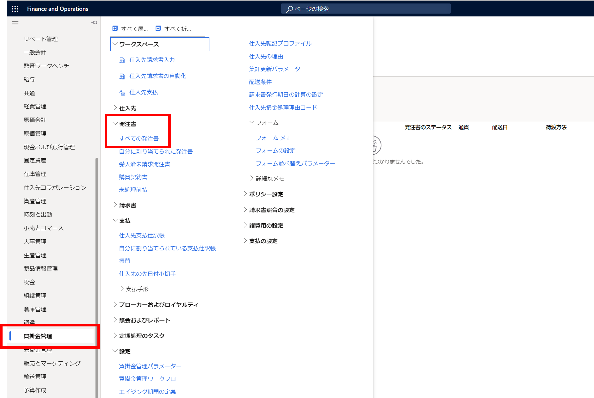
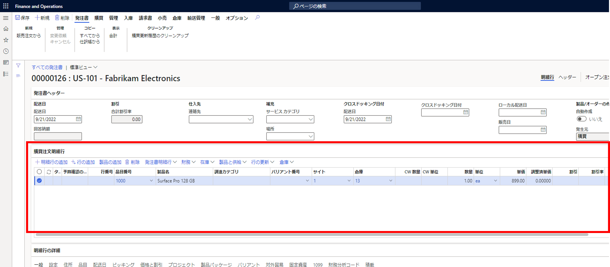
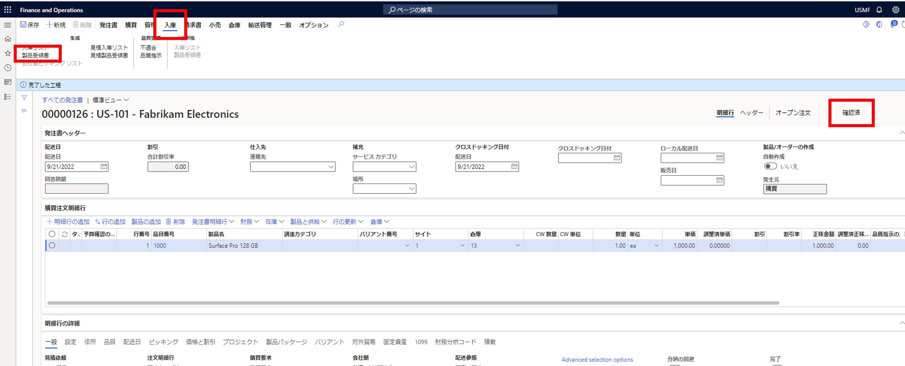
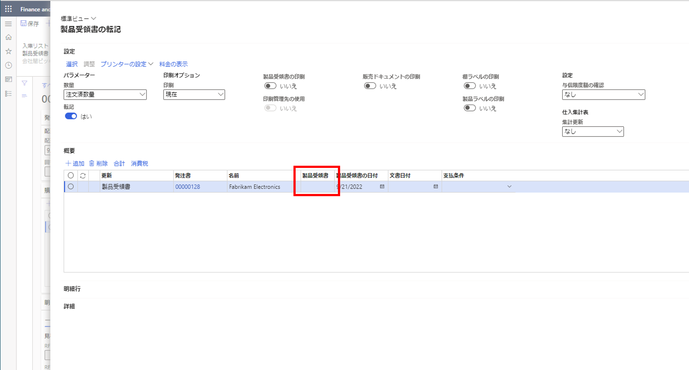
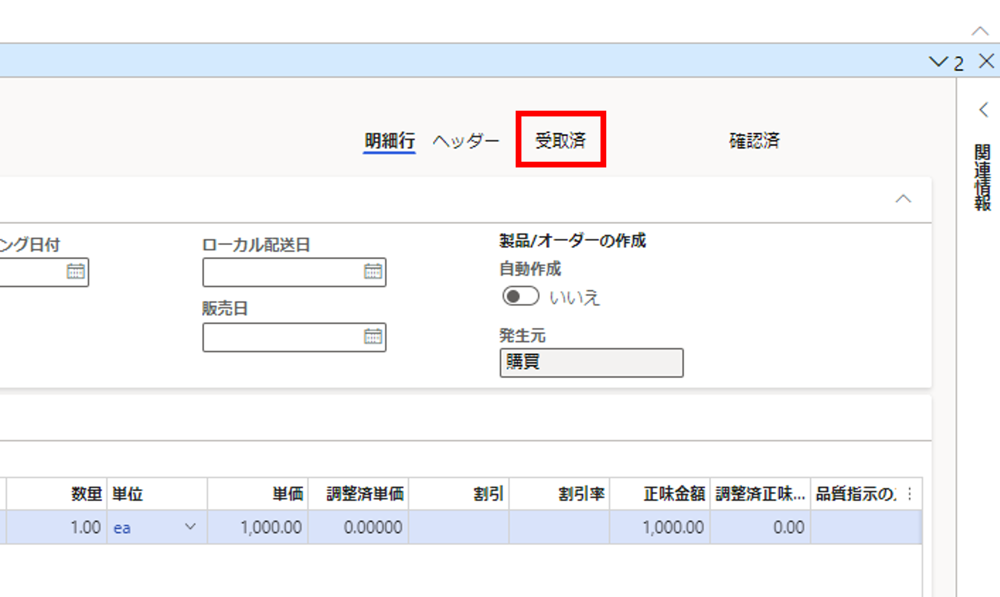
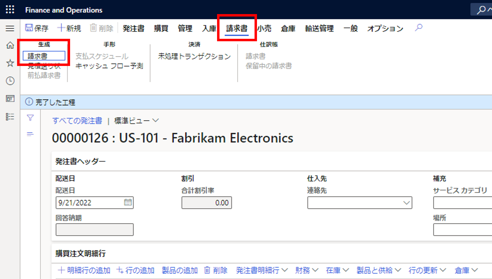
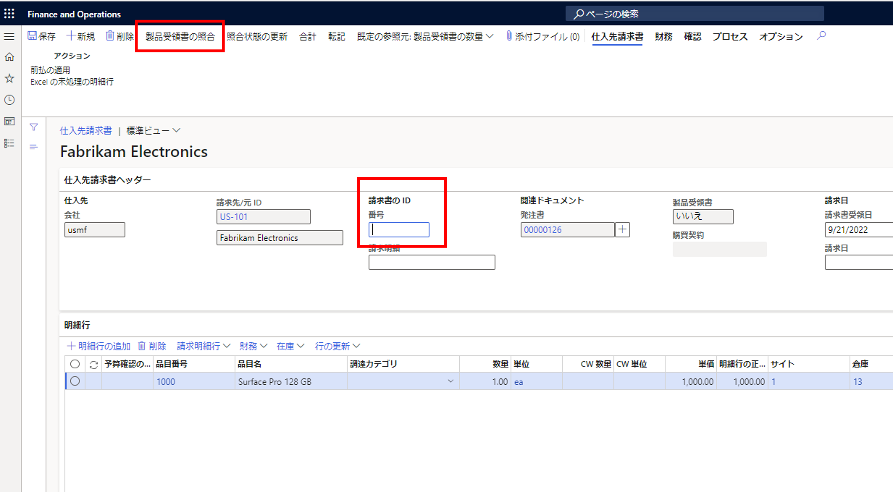

こんにちは、日本マイクロソフト Dynamics ERP サポートチームの道浦です。  
この記事では、 Dynamics 365 Finance and Operations にて、 発注書を作成する際の一連の流れについて紹介します。

<!-- more -->
## 検証に用いた製品・バージョン
Dynamics 365 Finance and Operations      
Application version: 10.0.28    
Platform version: PU52  

## 発注書作成の一連の流れ

1. 買掛金管理 > 発注書 > すべての発注書の順にクリックする  
    

2. 左上の「+ 新規」をクリックし、「仕入れ先」を入力する
    設定が完了した後、OK ボタンをクリックする  
    ※仕入れ先を入力すると、「名前」以降は自動入力されます
    

3. 「購買注文明細行」に必要な項目を入力する  
    ※「品目番号」を入力すると、製品マスタに登録している内容は自動入力されます
    

4. 左上の「保存」ボタンをクリックする

5. 購買 > アクション > 確認の順にクリックし、発注書の入力内容を確認する
    

6. 画面右の部分が「確認済」になっていることを確認する  
    確認後、入庫 > 生成 > 製品受領書の順にクリックする
    

7. 「製品受領書」に任意の「製品受領番号」を入力し、「 OK 」をクリックする  
    画面遷移後、画面右側の部分に「受領済」が表示されていると、梱包明細が転記されたことになる  
    ※製品受領番号を入力する際は、重複する番号は使用できない

    
    

8. 請求書 > 生成 > 請求書の順にクリックする
    

9. 任意の「請求書のID」の番号を入力し、「製品受領書の照合」をクリックする  
    ※請求書のIDを入力する際は、重複する番号は使用できない
    

10. 内容を確認したのち「OK」ボタンをクリックする

---
## おわりに  

以上、 Dynamics 365 Finance and Operations にて、発注書作成の一連の流れについてご紹介しました。
より詳細な情報が必要な場合、弊社テクニカルサポート, Customer Success Account Manager (CSAM), Customer Engineer (CE) までお問い合わせください。
