こんにちは、日本マイクロソフト Dynamics ERP サポートチームの道浦です。  
この記事では、 Dynamics 365 Finance and Operations にて、 販売注文作成の一連の流れについて紹介します。

<!-- more -->
## 検証に用いた製品・バージョン
Dynamics 365 Finance and Operations      
Application version: 10.0.28    
Platform version: PU52  

## 販売注文作成の一連の流れ

1. 売掛金管理 > 注文 > すべての販売注文の順にクリックします。  
    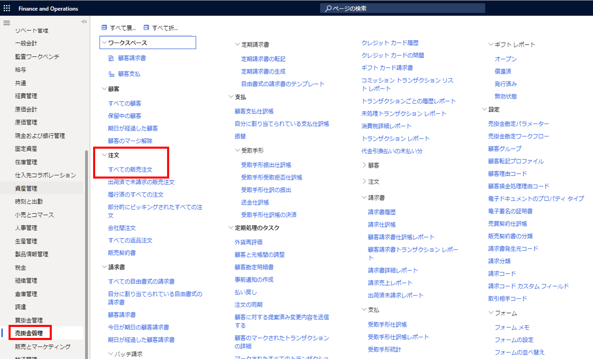

2. 左上の「+ 新規」をクリックし、「顧客ID」を入力します。
    設定が完了した後、OK ボタンをクリックします。  
    ※顧客IDを入力すると、「名前」以降は自動入力されます。
    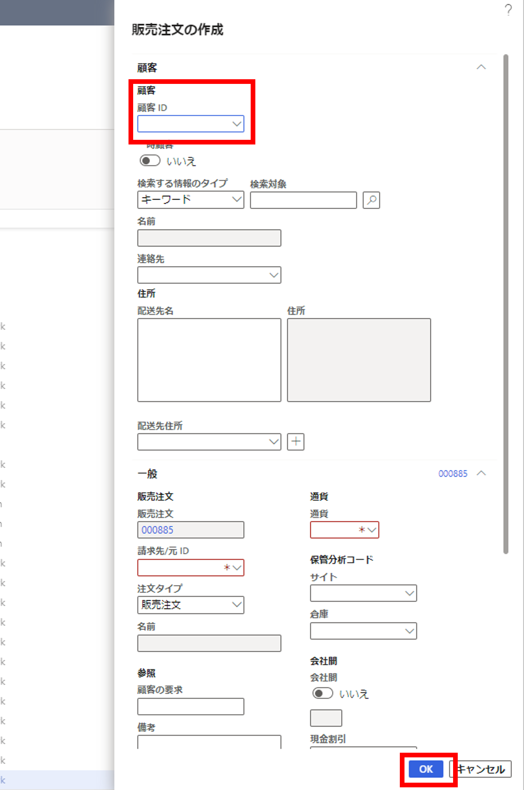

3. 「購買注文明細行」に必要な項目を入力します。  
    ※「品目番号」を入力すると、製品マスタに登録している内容は自動入力されます。
    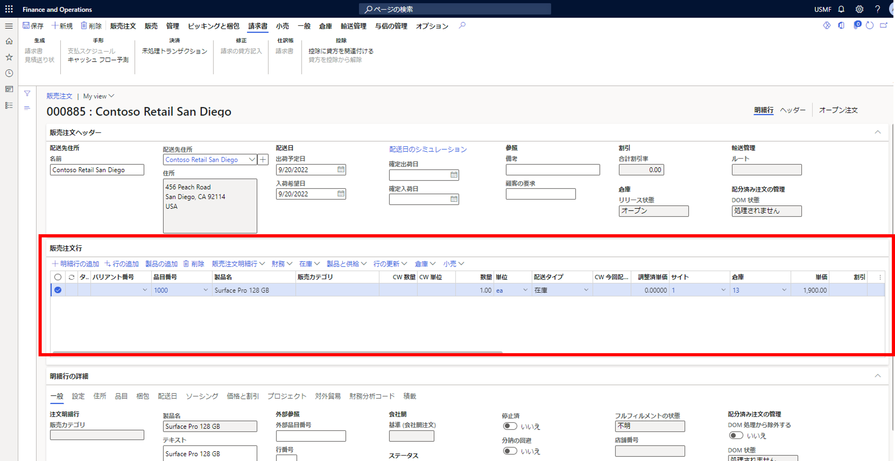

4. 左上の「保存」ボタンをクリックします。

5. 販売 > 生成 > 販売注文の確認の順にクリックし、販売注文の入力内容を確認します。確認後「 OK 」のボタンをクリックします。
    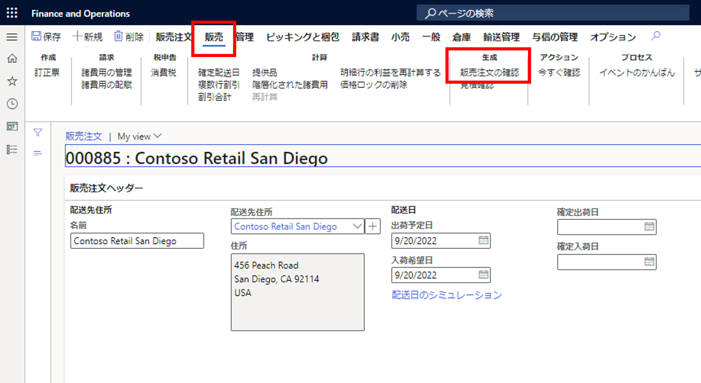 
     

6. ピッキングと梱包 > 生成 > ピッキングリストの生成の順にクリックします。  
※ピッキングリストを作成する必要がない場合は、6,7 番の手順はスキップします。
    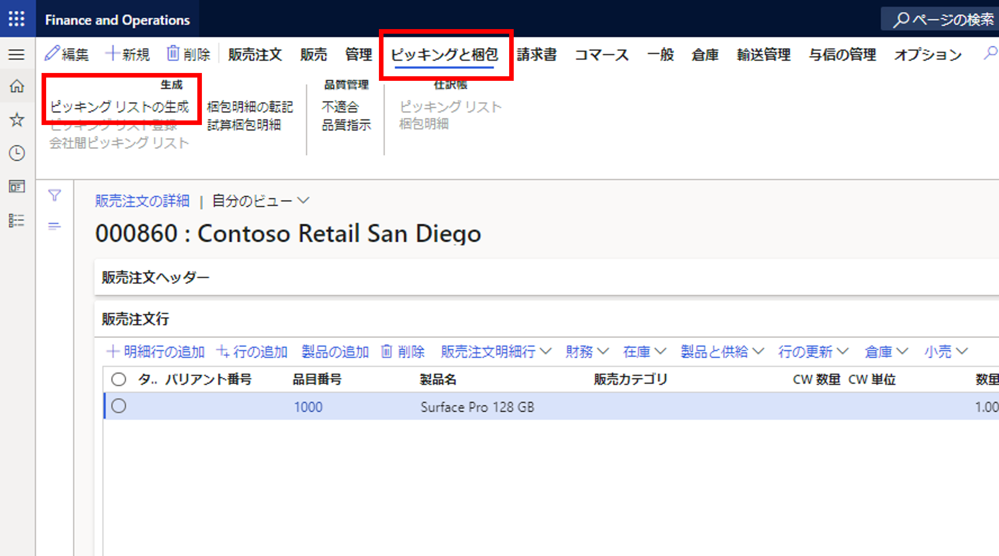 

7. 入力内容を確認し、「 OK 」をクリックします。
    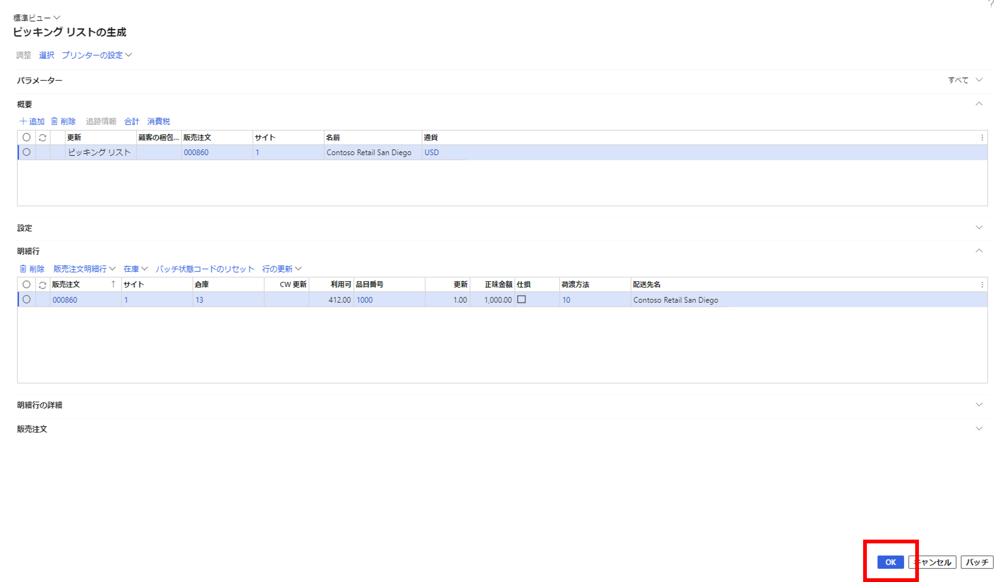 

8. ピッキングと梱包 > 生成 > 梱包明細の転記を順にクリックします。
    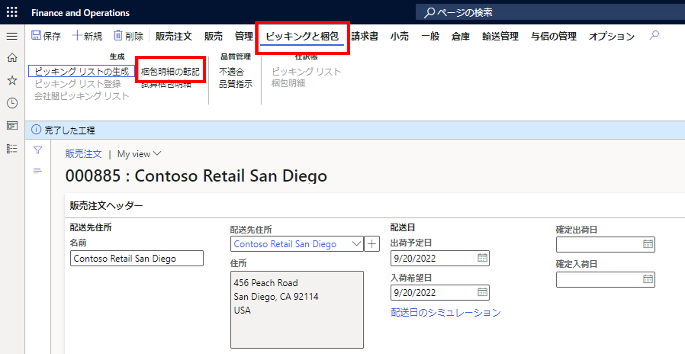 

9. 「パラメーター」の数量のところ 6,7 番の手順を行った方は「ピッキング済み」、6,7 番の手順をスキップした方は「すべて」に変更します。  

    < ピッキングリスト作成された方 >  
    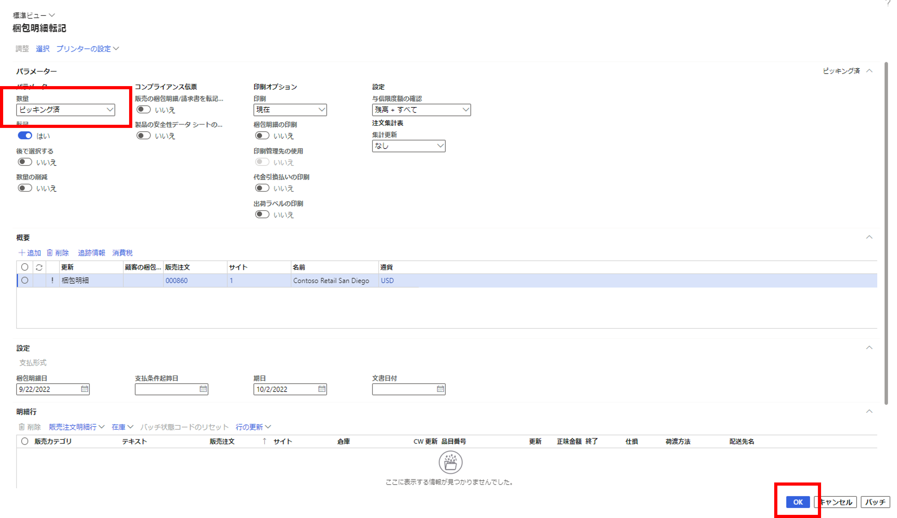   
    < ピッキングリストの作成をスキップされた方 >  
    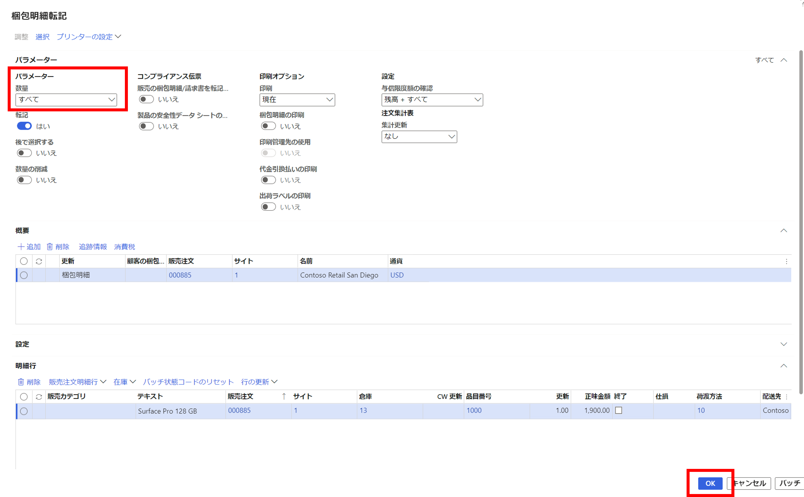 

10. 請求書 > 生成 > 請求書の順にクリックします。
    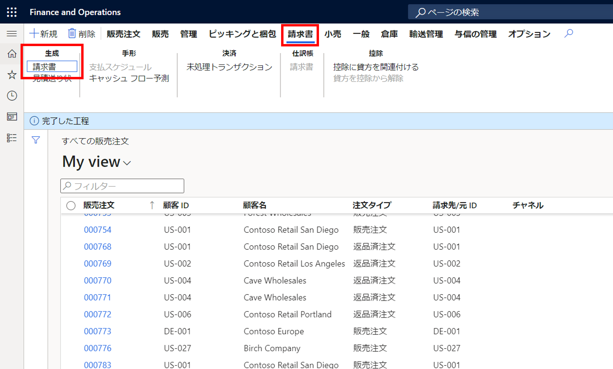

11. 請求の転記する内容を確認して、「 OK 」をクリックします。
    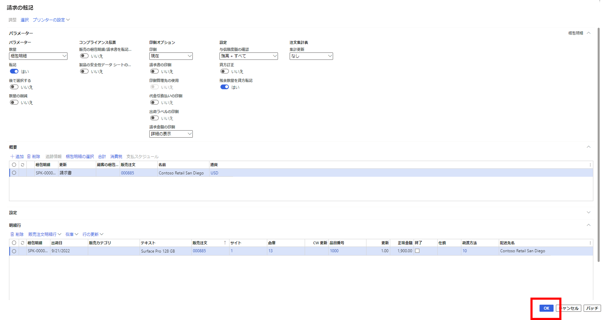

12. 画面遷移後、画面右上のところに「請求済」が表示されます。  
    表示されれば販売注文が無事に作成されたことになります。
     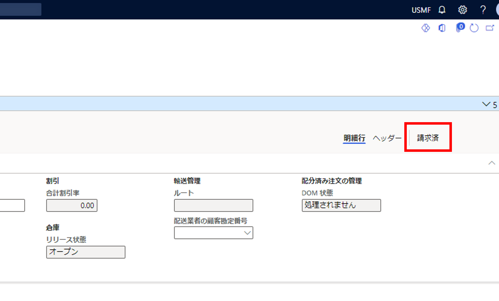   

---
## おわりに  

以上、 Dynamics 365 Finance and Operations にて、販売注文作成の一連の流れについてご紹介しました。
より詳細な情報が必要な場合、弊社テクニカルサポート, Customer Success Account Manager (CSAM), Customer Engineer (CE) までお問い合わせください。
