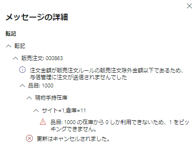
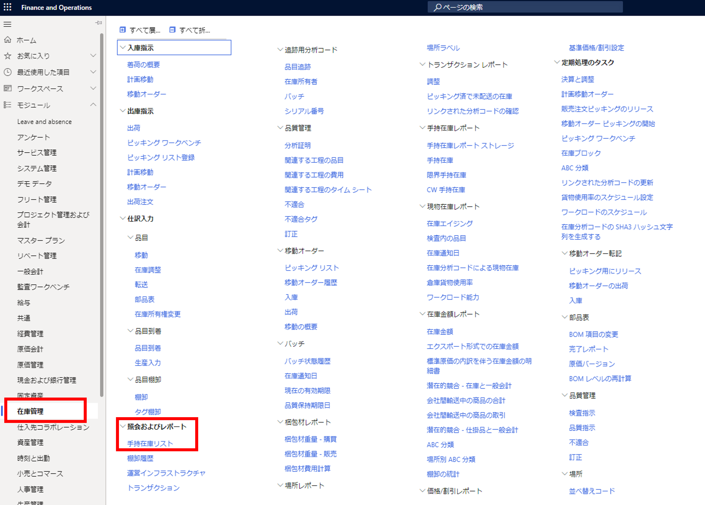
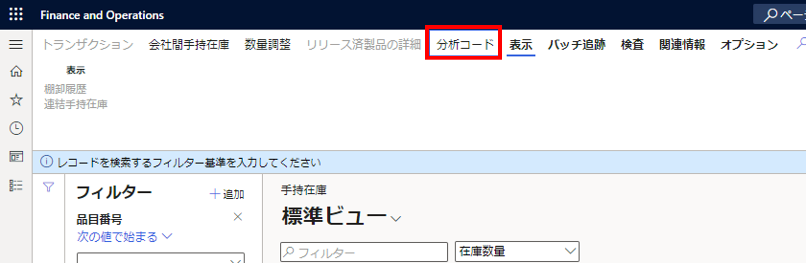
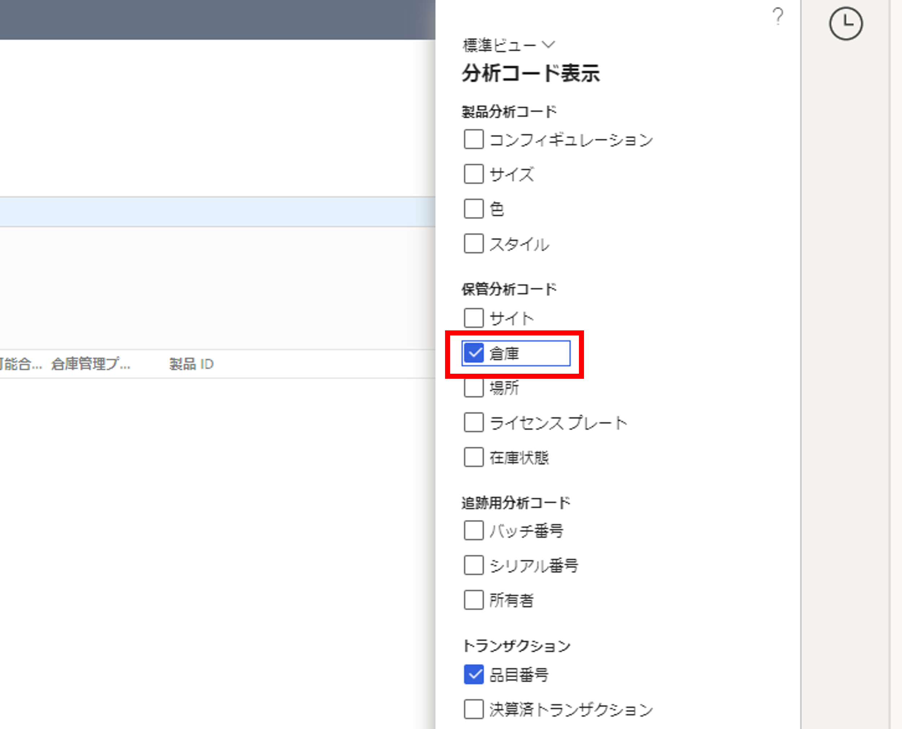
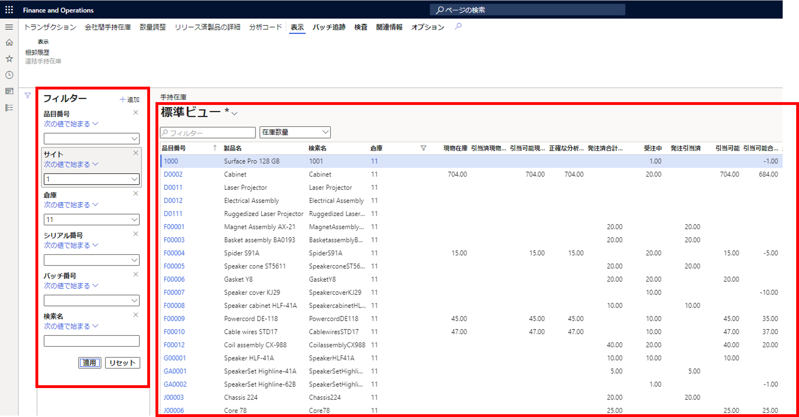
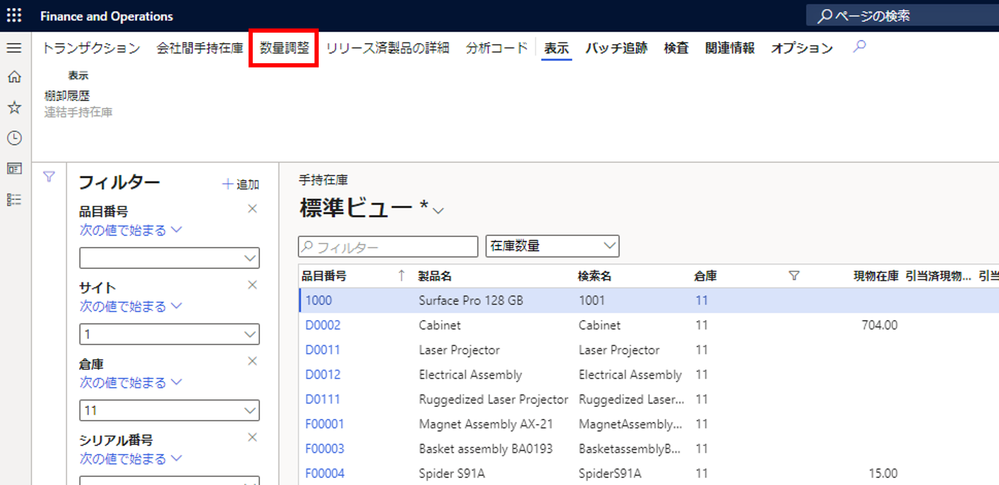
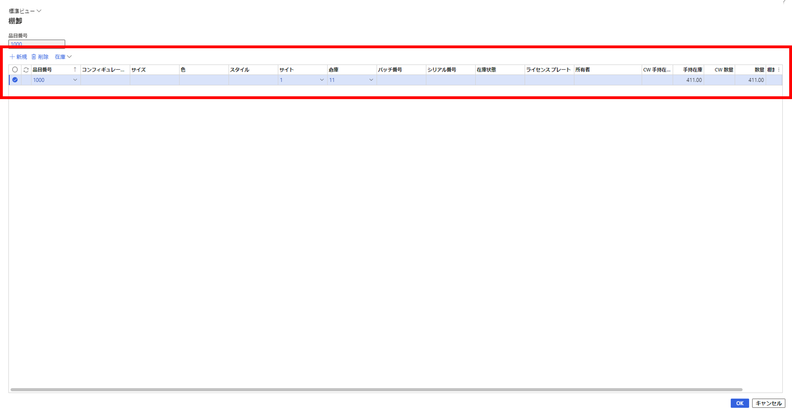
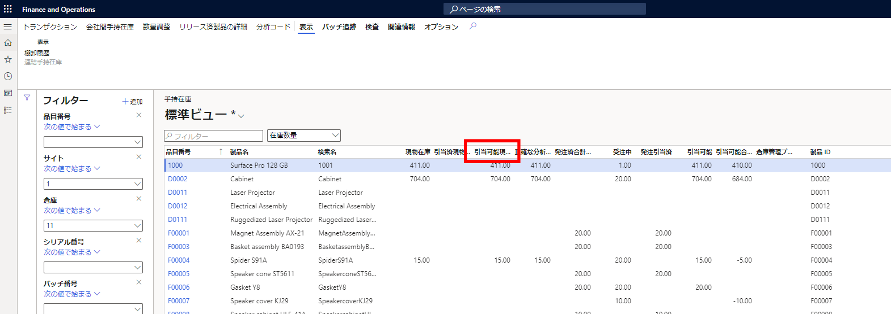

こんにちは、日本マイクロソフト Dynamics ERP サポートチームの道浦です。  
この記事では、 Dynamics 365 Finance and Operations にて、 販売注文作成時に「梱包明細の転記」を実施した際に生じる可能性のあるエラーの解決方法を紹介します。

<!-- more -->
## 検証に用いた製品・バージョン
Dynamics 365 Finance and Operations      
Application version: 10.0.29  
Platform version: PU53  

## エラーの内容と原因について

本ブログが対象とする警告内容は下記のものとなります。  
    
 
原因：指定した倉庫に対象の商品の在庫がない場合に上記のエラーが発生します。  
解決方法：対象品目を発注、もしくは製造することで、手持在庫数量が増え、エラーを解消することが可能となります。
また1つの回避策として手持在庫画面から数量調整を実施する方法でも対応可能となります。

以下の手順では、手持在庫画面から対象商品の数量を増やす方法を記載いたします。

## 手持在庫画面から対象商品の数量を増やす手順について

1. 在庫管理 > 紹介およびレポート > 手持在庫リストの順にクリックする
    

2. 「分析コード」タブをクリックし、分析コード表示に「倉庫」を表示する
    
    

3. 画面左の「フィルター」で対象商品を検索し、倉庫に在庫がないことを確認する
    

4. 数量調整タブをクリックする
    

5. 対象の倉庫等に手持ち在庫の数量を追加する
    

6. 「引当可能現物数」の数量が増えていれば、棚卸は完了となります
    

---
## おわりに  
以上、販売注文作成時に「梱包明細の転記」を実施した際に生じる可能性のあるエラーの解決方法についてご紹介しました。
より詳細な情報が必要な場合、弊社テクニカルサポート, Customer Success Account Manager (CSAM), Customer Engineer (CE) までお問い合わせください。
