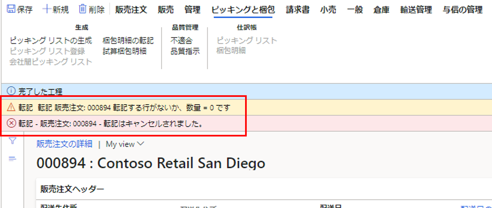
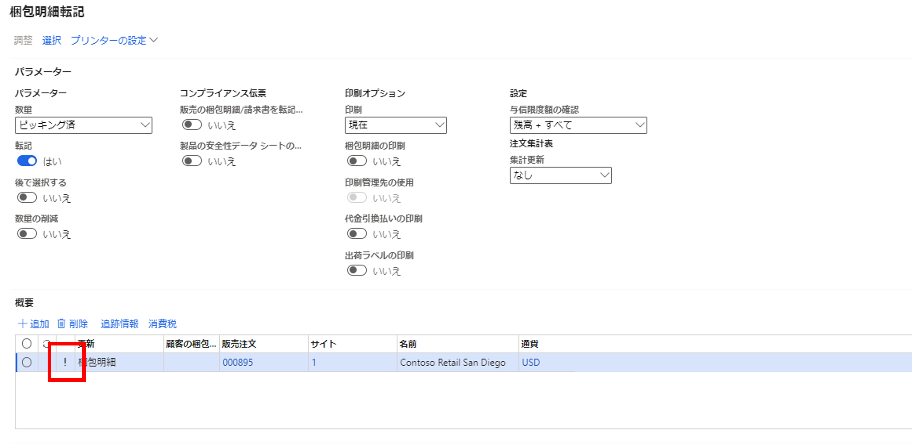
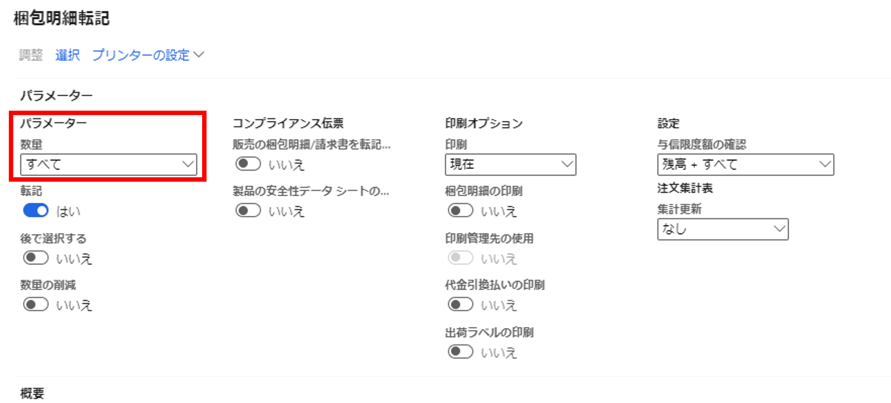
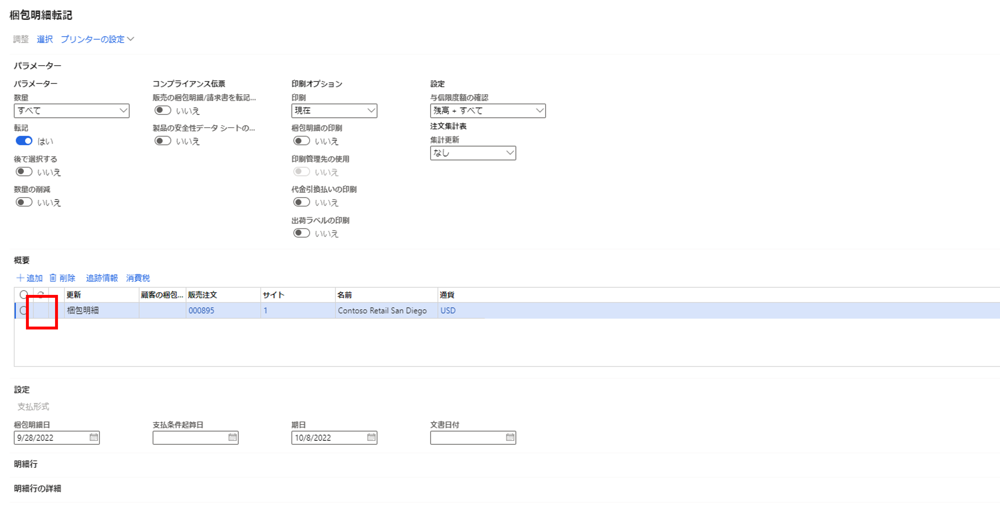

こんにちは、日本マイクロソフト Dynamics ERP サポートチームの道浦です。  
この記事では、 Dynamics 365 Finance and Operations にて、 販売注文作成時に「梱包明細の転記」を実施した際に処理が中断されるエラーの解決方法を紹介します。

<!-- more -->
## 検証に用いた製品・バージョン
Dynamics 365 Finance and Operations      
Application version: 10.0.29  
Platform version: PU53  

## エラーの内容と原因、および解決策について

本ブログが対象とするエラー内容は下記のものとなります。  
    
 

原因：梱包明細の転記を行う際に、ピッキングを行っていない販売注文をピッキング済みとして処理した場合に発生します。  
梱包明細転記の確認画面において、ピッキング済みとして処理しようとした際に、「！」マークが表示されます。「！」マークが表示のまま実行すると転記が自動的にキャンセルされます。
 
   
 

解決方法：ピッキングを行わずに梱包明細の転記を行う場合は、パラメーターの値を「ピッキング済」から「すべて」に変更する。

1. 梱包明細の転記を行う際に、「パラメーター」の部分を「ピッキング済」から「すべて」に変更をする
   

2. 変更後、「！」が消えているのを確認し、転記を実行する
  

## 参考
梱包明細の転記を行う前にピッキングの生成を行う場合は、弊社が公開している「販売注文作成の一連の流れ」に方法を記載していますので、合わせてご参照ください。 
https://jpdynamicserp.github.io/blog/D365FO%20App%20SCM/how-to-create-sales-order/

---
## おわりに  
以上、販売注文作成時に「梱包明細の転記」を実施した際に処理が中断されるエラーの解決方法についてご紹介しました。
より詳細な情報が必要な場合、弊社テクニカルサポート, Customer Success Account Manager (CSAM), Customer Engineer (CE) までお問い合わせください。
