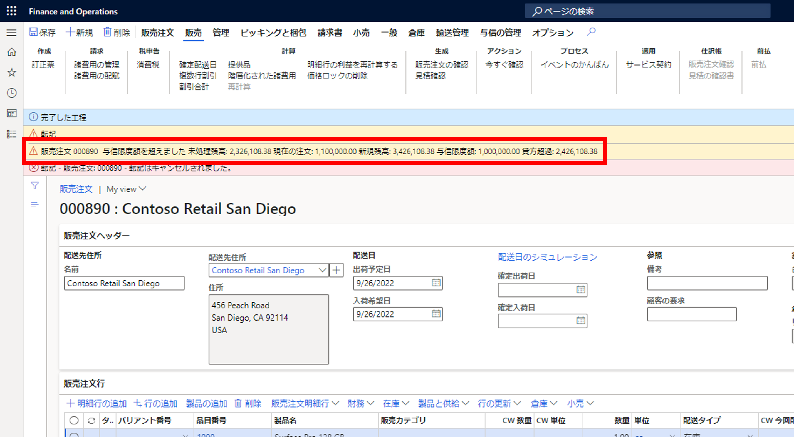
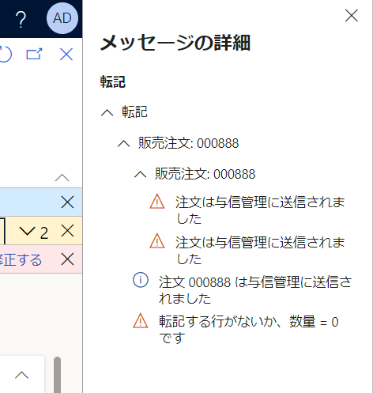
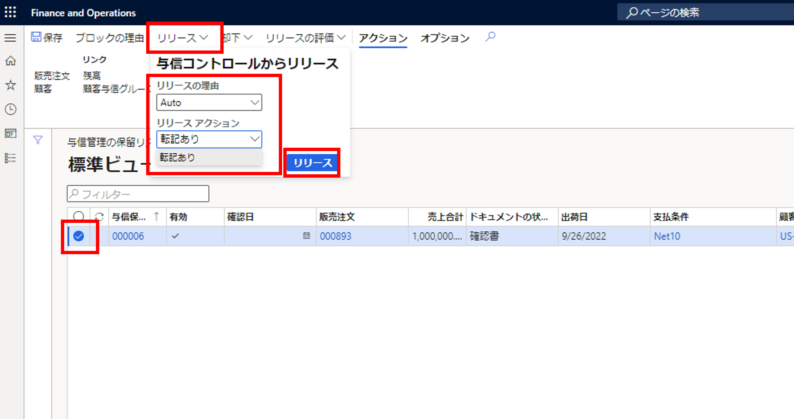
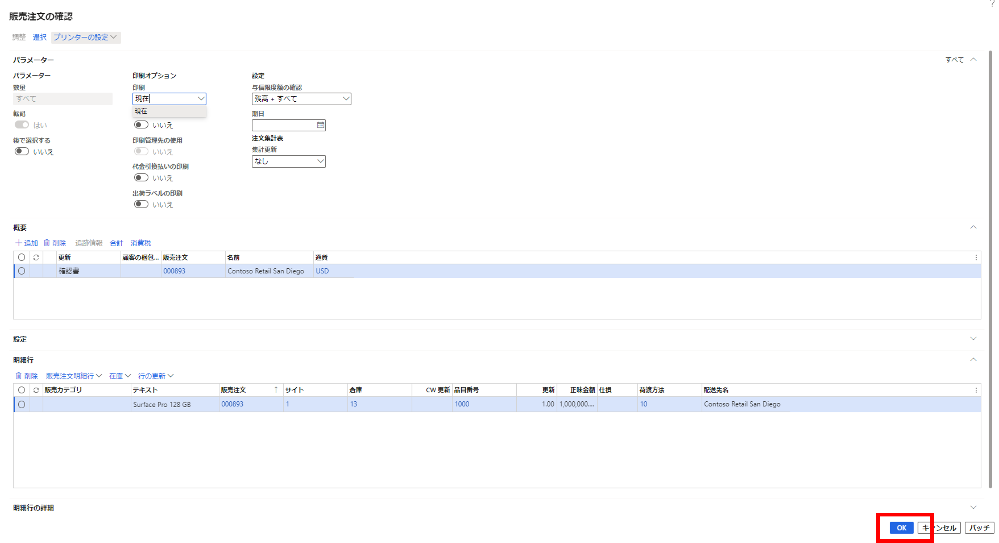
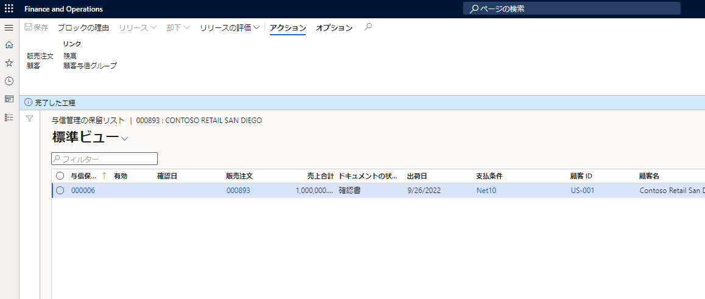

こんにちは、日本マイクロソフト Dynamics ERP サポートチームの道浦です。  
この記事では、 Dynamics 365 Finance and Operations にて、 販売注文の作成にて「販売注文の確認」を実施した際に生じる可能性のある警告の解決方法を紹介します。

<!-- more -->
## 検証に用いた製品・バージョン
Dynamics 365 Finance and Operations      
Application version: 10.0.29  
Platform version: PU53  

## 警告の内容と原因について

本ブログが対象とする警告内容は下記のものとなります。  
    
    

原因：設定した販売注文明細行の合計額が与信限度額を超えている場合に警告が発生します。

解決方法：一時的な与信限度額の金額を変更することで、警告を解消することができます。
また1つの回避策として一時的な与信限度額の制限を解放する方法でも対応可能となります。

以下の手順では、一時的な与信限度額の制限を解放する方法を記載いたします。

1. 対象の販売注文を選択し、「与信の管理」タブの「与信管理の保留リスト」を選択する
   

2. 対象のラインを選択し、リリースをクリックする  
クリック後に開かれるダイアログの「リリースの理由」で該当するものを選択し、「リリース」をクリックする
   

3. 手順 2 の「リリースアクション」で「転記あり」を設定すると、下記の画面が表示されるので、何も変更をせず OK をクリックする
   

4. 処理の完了後、元の販売注文画面に戻り、その後の処理を進める
   

## 参考
手順4以降の処理につきましては、下記の「販売注文作成の一連の流れ」の記事に記載しておりますので、ご参照ください。
https://jpdynamicserp.github.io/blog/D365FO%20App%20SCM/how-to-create-sales-order/#more

---
## おわりに  
以上、販売注文の作成にて「販売注文の確認」を実施した際に生じる警告の解決方法についてご紹介しました。
より詳細な情報が必要な場合、弊社テクニカルサポート, Customer Success Account Manager (CSAM), Customer Engineer (CE) までお問い合わせください。