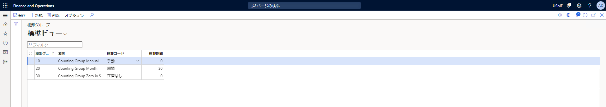
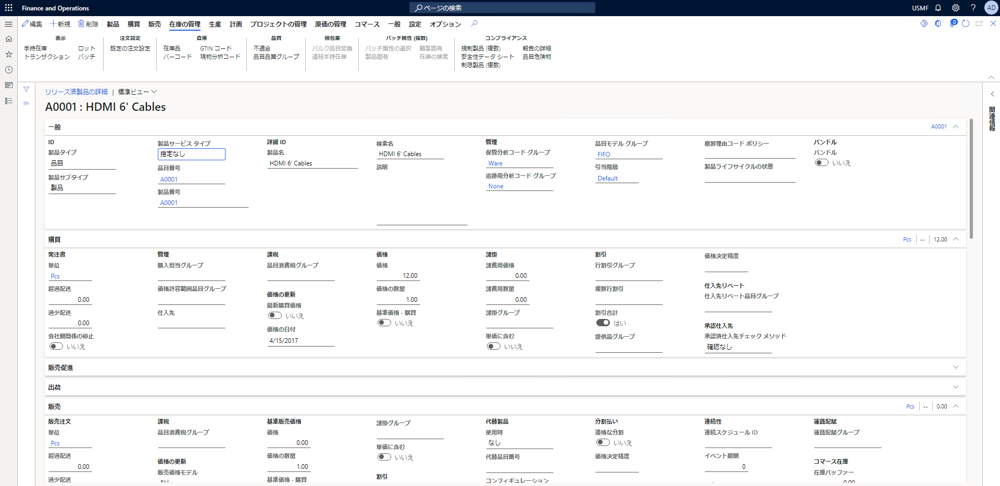
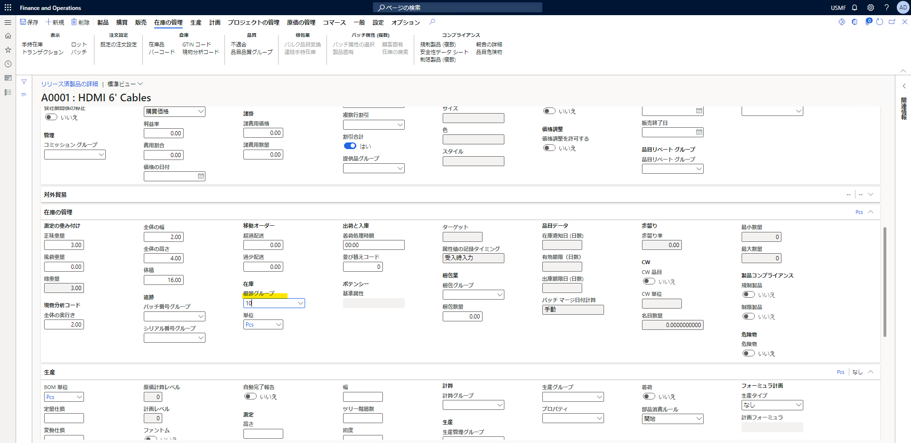
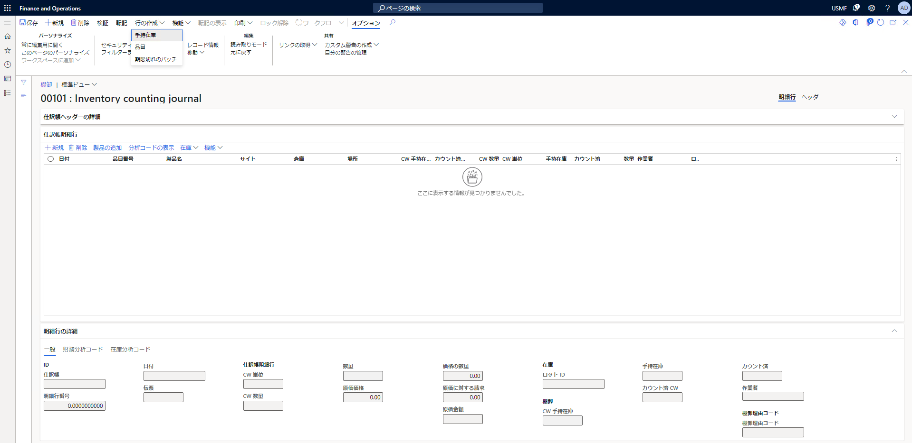
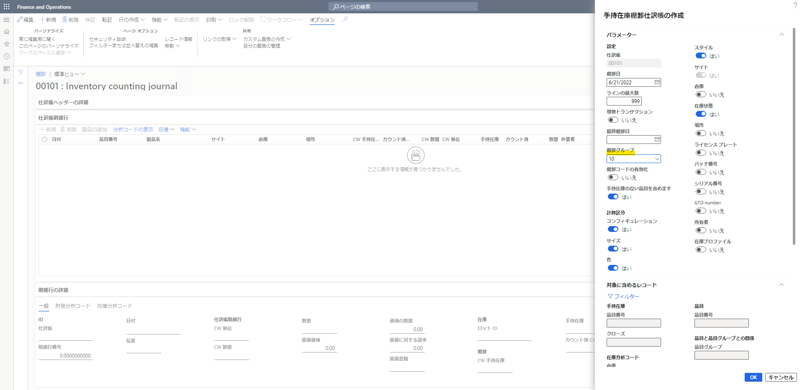
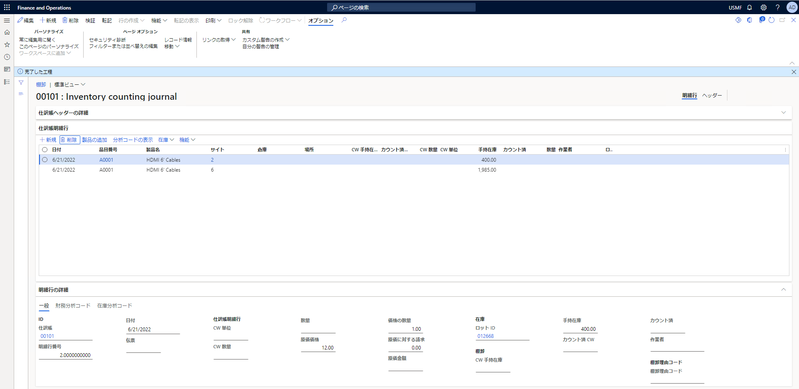

こんにちは、Dynamics ERP サポートの細野です。  
この記事では、棚卸グループを使用した棚卸の実施方法についてご案内いたします。  

<!-- more -->
## 検証に用いた製品・バージョン
Dynamics 365 Finance and Operations      
Application version: 10.0.25
Platform version: PU49

棚卸グループを活用することにより、在庫棚卸仕訳帳において複数の品目に対する明細を簡単に作成することができます。
具体的な操作手順は以下の通りです。  

## 操作手順
### 棚卸グループの登録方法
1. 在庫管理 > 設定 > 在庫 > 棚卸グループ と遷移する
1. 「新規」を選択する
1. 「棚卸グループ」「名前」を指定する
1. 「棚卸コード」を選択する
1. 「保存」を選択する

***  

### 棚卸グループの割当
1. 製品情報管理 > 製品 > リリース済製品 と遷移する
1. 一覧で、棚卸ポリシーを設定する製品の品目を選択する
        
    追跡される在庫から品目を選択する必要があります。 非在庫製品はカウントできません。

1. 編集 を選択する
1. 在庫の管理 セクション を展開する
1. 棚卸グループ フィールドのドロップダウン メニューで、以前に作成した棚卸グループを選択する

1. 保存 を選択する

***  

### 在庫棚卸仕訳帳での操作手順
1. 在庫管理 > 仕訳入力 > 品目棚卸 > 棚卸 と遷移する
1. 「新規」を選択し、新規に在庫棚卸仕訳帳を作成する
1.	在庫棚卸仕訳帳にて「行の作成」を選択し、「手持在庫/品目/期限切れのバッチ」のいずれかを選択する

1. 「手持在庫」を選択した場合、下記画像のダイアログが表示される
1. ダイアログにて棚卸グループを指定し、OKを選択する

1. 下記画像のように棚卸グループに設定されている品目など、上記ダイアログの条件に該当する品目に対して明細行が追加される

## おわりに
---
以上、棚卸グループを使用した棚卸の実施方法についてご紹介いたしました。  

参考：
https://docs.microsoft.com/ja-jp/dynamics365/supply-chain/inventory/tasks/define-inventory-counting-processes#create-a-counting-group
