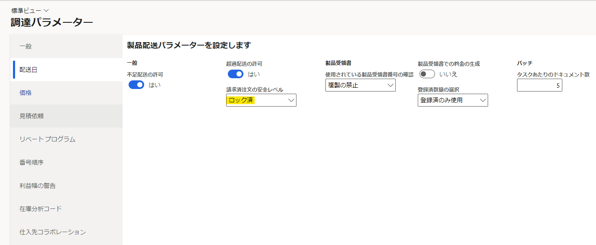
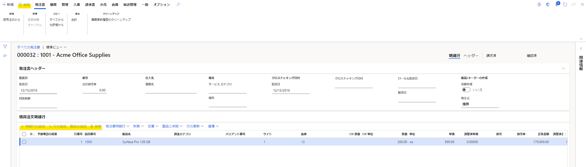
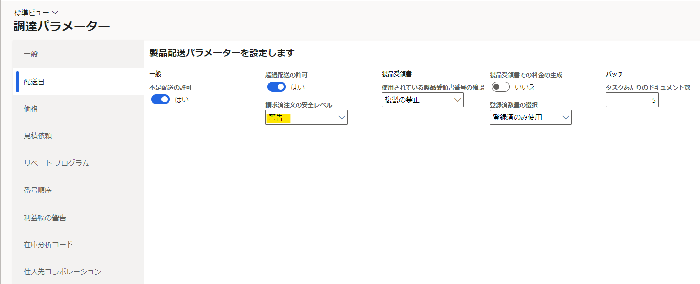
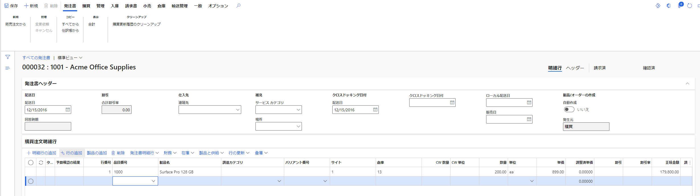
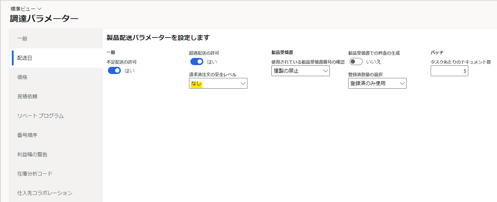

こんにちは、Dynamics ERP サポートの木村です。  
この記事では、請求後の発注書の編集を制御するパラメータについてご案内いたします。  

<!-- more -->
## 検証に用いた製品・バージョン
Dynamics 365 Finance and Operations      
Application version: 10.0.24  
Platform version: PU48

パラメータの適用方法、動作につきましては以下をご覧ください。  

## 請求後の発注書の編集制御方法
### 「請求済注文の安全レベル」を**警告**に変更した場合
1. 調達 > 設定 > 調達パラメーターを開く
1. 配送日タブを開く
1. 「請求済注文の安全レベル」を**ロック済**に変更し、保存する

1. 請求済の発注書を開く    
**-> 明細行の追加などのボタンが非活性になる**

***  

### 「請求済注文の安全レベル」を**警告**に変更した場合

1. 明細行の追加などのボタンを押下する
1. 以下ダイアログが表示され、「はい」を押下する  
     
**-> ダイアログは表示されるが、請求済の発注書は編集可能となる**

***  

### 「請求済注文の安全レベル」を**なし**に変更した場合
  
**-> 請求済の発注書は常に編集可能**

## おわりに
---
以上、請求後の発注書の編集を制御するパラメータについてご紹介いたしました。  
請求した発注書に対して編集を制御されたいなどの場合には、上記パラメータをご利用ください。
