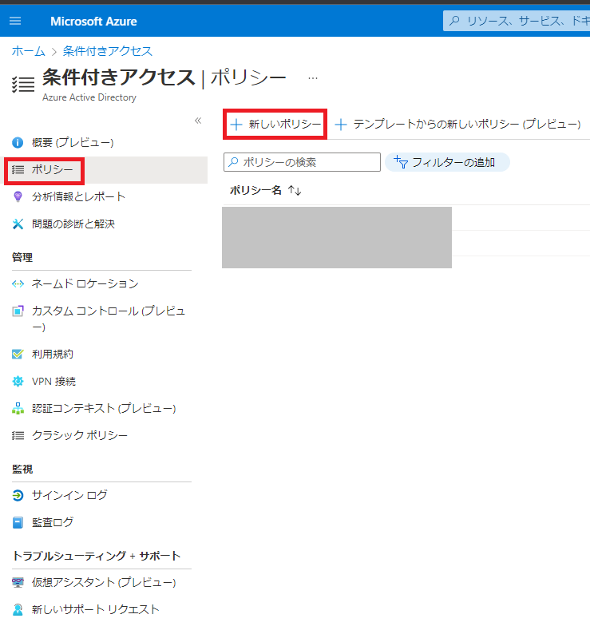
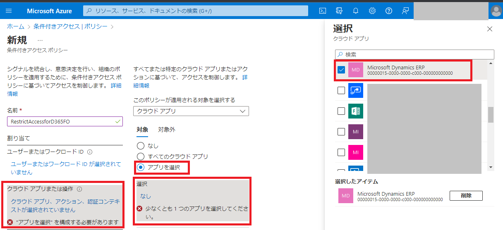
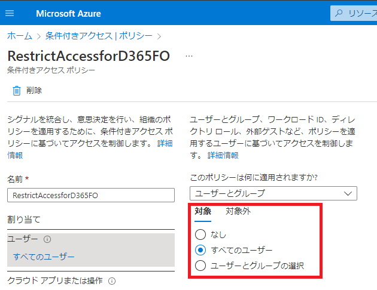
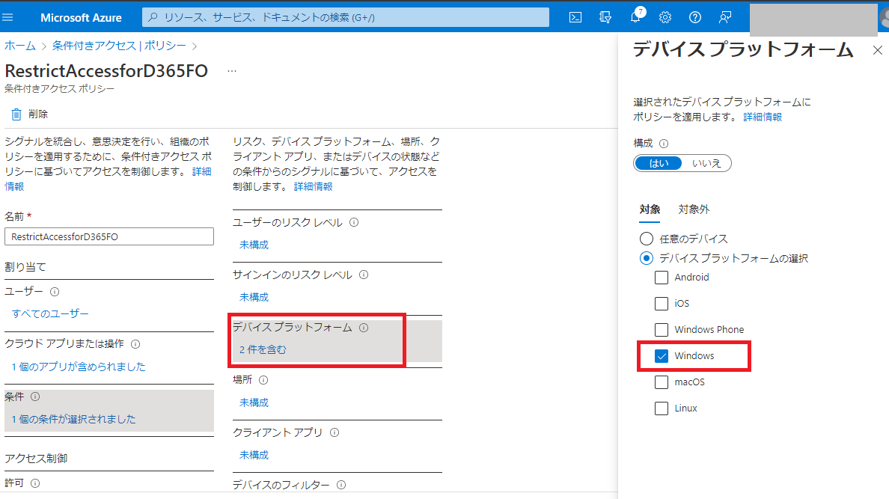
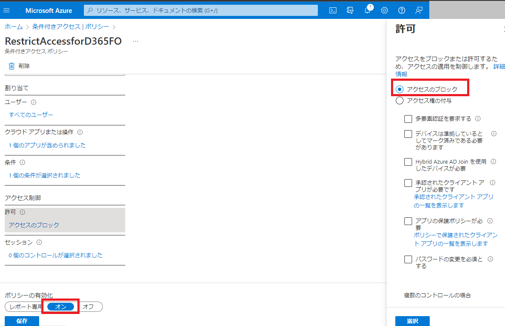
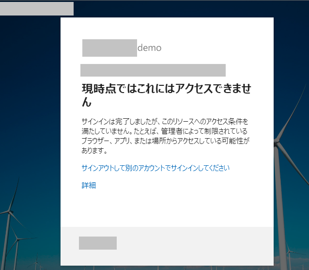

こんにちは、日本マイクロソフトの福原です。  
この記事では、 Azure AD 条件付きアクセスを使用して Dynamics 365 for Finance and Operations (D365FO) へのアクセスを制御する方法をご案内します。
Azure Active Directory (以下 Azure AD) の条件付きアクセス により、ユーザー、デバイス、場所などを基にして、 D365FO の環境へのアクセスを制御することが可能となります。

<!-- more -->
## 検証に用いた製品・バージョン:
Dynamics 365 Finance and Operations  
Application version: 10.0.28  
Platform version: PU52  
Azure AD Premium P2 ライセンス

## はじめに
以下の弊社 FastTrack の記事及び公開資料にも、 Azure AD 条件付きアクセスによる D365FO へのアクセス制御の手順が同様にご案内致しておりますのでご参考にして頂けますと幸いでございます。  
FastTrack の記事:  
https://github.com/microsoft/Dynamics-365-FastTrack-Implementation-Assets/tree/master/CloudSecurity/ConditionalAccess  
公開資料:  
https://learn.microsoft.com/ja-jp/power-platform/admin/restrict-access-online-trusted-ip-rules?toc=%2Fdynamics365%2Ffin-ops-core%2Fdev-itpro%2Ftoc.json&bc=%2Fdynamics365%2Fbreadcrumb%2Ftoc.json  

## 注意点
- Azure AD 条件付きアクセスをご利用いただくには、Azure Active Directory Premium (https://azure.microsoft.com/ja-jp/pricing/details/active-directory/) の ライセンスが必要となります。
- Azure AD 条件付きアクセスにより設定されるアクセス制御は Azure AD テナント内の全ての D365FO の環境 (本番環境、サンドボックス環境、クラウドホスト環境等) に適用されます。個別の環境のみに限ったアクセス制御を設定することはできません。

## 手順
以下の手順では、 Windows を使用しているすべてのユーザーからの D365FO へのアクセスをブロックするようなポリシーを作成します。
もし、別のデバイスからのブロックや、対象ユーザーの変更をご要望の場合には、ポリシー内の各対象の設定を変更することが可能です。
1. Azure portal にて、条件付きアクセスにアクセスし、新しいポリシーを選択します。
    

2. 新しいポリシーにて、`Microsoft Dynamics ERP` というアプリを選択します。これにより環境単位ではなく D365FO のアプリ単位でポリシーが適用されます。
    

3. ユーザーの対象範囲として、すべてのユーザーを選択します。
    

4. デバイスの対象範囲として、 Windows を選択します。
    

5. このポリシーが対象に合致するようなアクセスをブロックするために、ブロックを選択し、ポリシーの有効化のオンを選択します。
    

6. 上記のポリシーの設定後、 Windows のクライアント端末から D365FO の環境にアクセスしようとすると、アカウントの認証後に以下のようなエラーが表示され、 D365FO の環境にアクセスできないようになります。
    

## 注意
上記の手順、手順内の画像については本記事の執筆時のものです。
実際の画面とは挙動に違いがある可能性がございます。

---

## おわりに  
以上、Azure AD 条件付きアクセスを使用して D365FO へのアクセスを制御する方法を紹介いたしました。  
もし、お困りのこと等がございましたら、弊社までお問い合わせ頂きますようお願いいたします。
