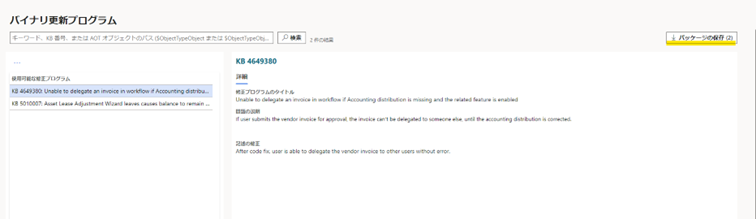
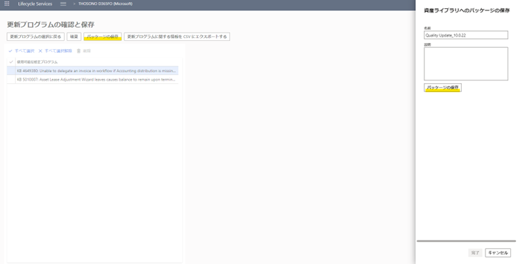
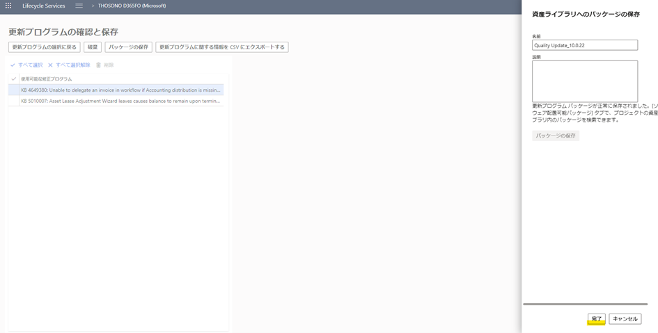
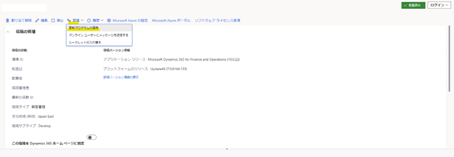
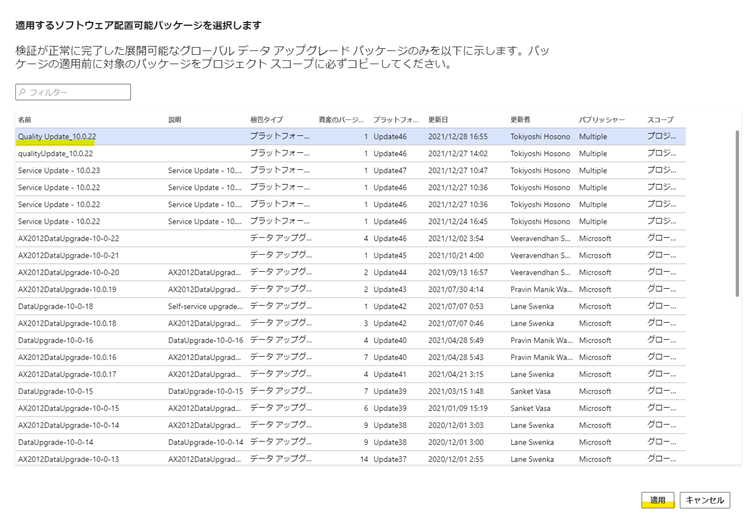

こんにちは、日本マイクロソフトの細野です。

この記事では、Dynamics 365 Finance and Operationsにて、品質更新プログラムを適用する方法を紹介します。
<!-- more -->

## 手順
1. LCSを開く
2. LCSにて対象の環境を選択し、対象環境の詳細画面を開く
3.  「利用可能な更新プログラム」のパネルを開く
4.  「品質更新プログラム」の「ビューの更新」を選択する
    

5. 「バイナリ更新プログラム」にて、「パッケージの保存」を選択する
   

    ※ 対象環境の修正プログラムの適用状況により、使用可能な修正プログラムに表示される内容は異なります。

6. 「更新プログラムの確認と保存」にて、「パッケージの保存」を選択する
7. 「資産ライブラリへのパッケージの保存」にて、名前を入力し「パッケージの保存」を選択する
    

8. 「資産ライブラリへのパッケージの保存」にて「パッケージの保存」が完了後、「完了」を選択する
    

9.  LCSにて対象の環境を開き、「管理」より「更新プログラムの適用」を選択する
    

10. 手順7で保存したパッケージを選択し、「適用」を選択する
※ 手順7の実施後、ダイアログにパッケージが表示されるまでに時間を要する場合があります。
    

11.	確認ダイアログにて「はい」を選択する
12.	LCSにて対象の環境を開き、「環境の更新」にて適用状況を確認する
    

（関連情報）
https://docs.microsoft.com/en-us/dynamics365/fin-ops-core/dev-itpro/deployment/apply-deployable-package-system

## 注意
品質更新プログラムの適用にあたり、対象環境にはダウンタイムが発生します。関連するサービスはすべて停止し、パッケージの適用中は環境を使用できなくなります。

上記の手順、手順内の画像については本記事の執筆時のものです。
実際の画面とは挙動に違いがある可能性がございます。

---
## おわりに  

以上、Dynamics 365 Finance and Operationsにて、品質更新プログラムを適用する方法をご紹介させていただきました。
もし、お困りのこと等がございましたら、弊社までお問い合わせ頂きますようお願いいたします。
