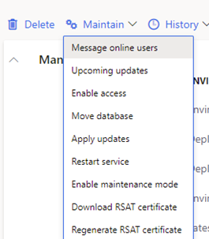
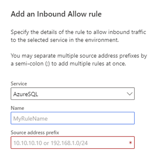
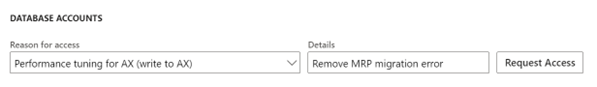
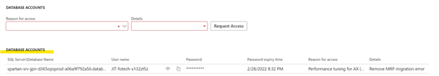
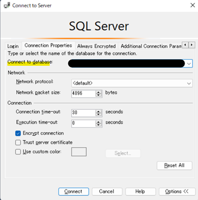
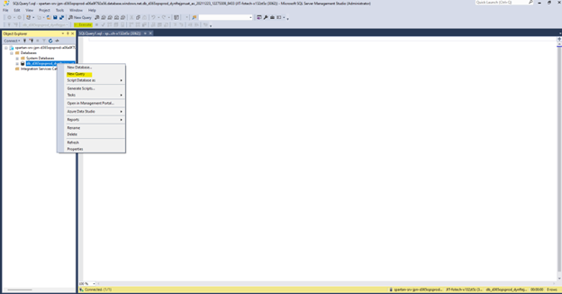

こんにちは、日本マイクロソフトの岡田です。
Dynamics 365 for Finance and Operations のSandbox 環境のデータベースに対して、クエリを実行することが可能です。
そのため Sandbox 環境では、さまざまな問題のトラブルシューティングのため、クエリ実行で問題を解消して頂くことが可能となっております。
本記事では、Sandbox 環境のデータベースへのアクセスを有効にし、クエリを実行する手順をご案内させていただきます。

<!-- more -->

## Sandbox 環境のデータベースでクエリを実行する手順
(1) LCS にログインし、Sandbox 環境の詳細ページを開きます。
(2) 管理 (Maintain) > アクセスの有効化 (Enable access) をクリックします。

(3) 受信規則の追加により、接続を許可する IP アドレスを設定します。
※接続を許可する IP アドレスとして、Cloud-hosed 環境 VM の IP アドレスを指定致しますと、Cloud-hosed 環境 VM の SSMS から Sandbox 環境のデータベースへアクセスすることが可能となります。

(4) データベースアカウントにて、書き込み権限を付与できる Performance tuning を選択し、Request Access をクリックし、アクセス権を申請します。

(5) データベースアカウントが作成された後に、「SQL Server\Database Name」 をコピーします。

(6) Windows キーをクリックし、検索バーに「SSMS」と入力し、SQL Server Management Studio を開きます。
※もしローカルに SSMS がインストールされていない場合、手順3 で Cloud-hosted 環境 VM の IP アドレスを指定頂ければ、 Cloud-hosted 環境 VM にインストールされている SSMS を使用頂けます。
(7) 接続ダイアログにて Options を開き、下記のように入力します。
    Server Name: 手順5 でコピーした値のうち、バックスラッシュより前の部分を貼り付け
    Authentication: “SQL Server Authentication”
    Login, Password: データベースアカウントにて作成されたアカウント

(8) “Connection Properties” タブを開き、手順5 でコピーした値のうち、バックスラッシュより後の部分を張り付けます。

(9) Connect をクリックし、サーバーに接続します。
(10) 対象のデータベース AxDB を右クリックし、「New Query」をクリックします。

(11) クエリを貼り付け、Execute　をクリックします。
(12) SQL Server Management Studio を閉じます。
(13) 変更を環境に反映させるため、Sandbox 環境の サービスを再起動します。
     LCS の Sandbox 環境の詳細ページを開き、 管理 (Maintain) > サービスのリセット (Restart service) をクリックします。
(14) ダイアログボックスで、再起動するサービス AX を選択してから OK をクリックします。

以上の手順を実施して頂くことで、Sandbox 環境のデータベースでクエリを実行することが可能です。

---
## おわりに  
以上、 Sandbox 環境のデータベースでクエリを実行する手順をご紹介させていただきました。上記の手順でご不明な点等ございましたら、お気兼ねなく弊社までお問合せ頂ければと思います。
