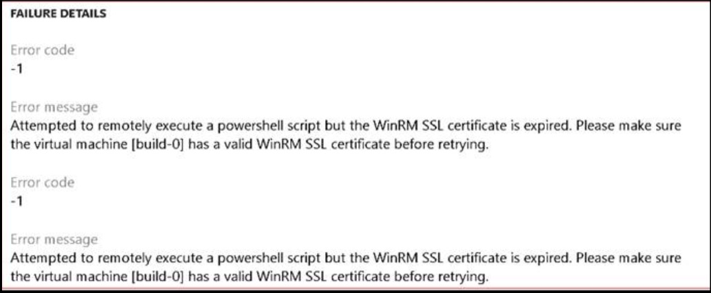
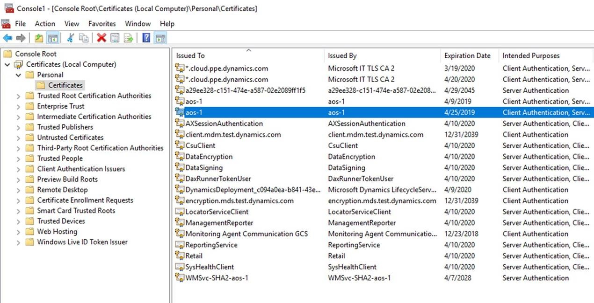
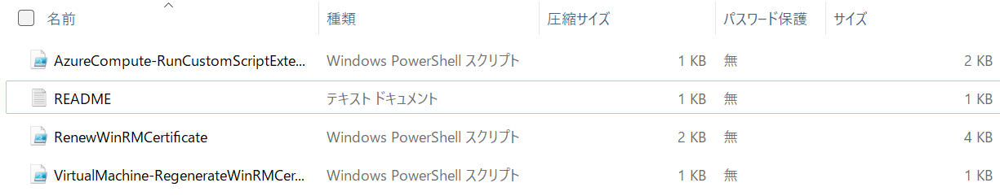
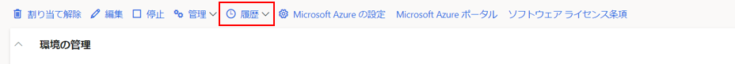

こんにちは、日本マイクロソフトの佐藤です。

この記事では、Dynamics 365 for Finance and Operationsを使用した際に証明書が有効でない旨のエラーが出た際の対処法をまとめます。

<!-- more -->

## まず初めの対処法
プロジェクトオーナーまたは環境管理者は、LCSから証明書を入れ替えることができます。
証明書の入れ替えを行うには、LCS の環境の詳細ページで[管理] > [シークレットの入れ替え] を選択してシークレットを入れ替える手順を実行します。
エラーが出なければ、本Blogの『履歴の確認』項目の操作にて、[シークレットの入れ替え] の完了が確認できます。

## 別のエラーが出た場合の対処法
ですが、[シークレットの入れ替え] にて、WinRM SSL証明書のエラーが出る場合があります。
サブスクリプションでデプロイされた環境のうち、Microsoft によって管理されていない環境では、WinRM SSL証明書の有効期限は環境がデプロイされた日から 1 年です。WinRM SSL証明書の有効期限が切れている場合、LCSの環境の詳細ページから、[管理] > [シークレットの入れ替え] を使用してシークレットを入れ替えると、次のエラーメッセージが表示されます。
    

WinRM SSL証明書の有効期限は、リモートデスクトップで環境にログインしたら、検索にcertmgr と入力してCertificate Managerを開き、Local Machine / Personal / Certificates に移動すると確認することができます。 WinRM SSL証明書の名前は、デプロイされたVMの名前と同じになります。
    

このWinRM SSL証明書を更新するには、以下に示す手順に従います。

## WinRM SSL証明書の更新手順
1. LCSを開く
2. LCSのプロジェクト選択画面にて、右側にあります「共有アセットライブラリ」のパネルを開く
4. 資産タイプにて「モデル」を選択する
5. 「Renew WinRM certificate」フォルダーをダウンロードする
6. RenewWinRMcertificate.zip ファイルをローカルフォルダに解凍します。
   フォルダ内は以下のようになっています。（2022/07/現在）
   

7. フォルダ内のREADME.txtに記載されている手順に従います。

## README.txtの内容
現在README.txtには以下のような内容が書かれています（2022/07/現在）
1.	ZIPパッケージからファイルをダウンロードし、解凍する
2.	管理者としてpowershellを開く
3.	解凍したファイルがあるフォルダを選択
4.	最新の Azure Powershell がインストールされていることを確認し、次の手順に従います。Azure Powershellのインストール手順は以下のリンクにあります。 （txt記載のURLのリンクが切れているため、別のURLを下記に記載しています）

　　https://docs.microsoft.com/ja-jp/powershell/azure/?view=azps-8.0.0

5.	Powershellのスクリプトを実行するための入力データを準備する。:
	a.	VM が配置されている Azure Subscription ID
	b.	VM が配置されているリソースグループ名
6.	Powershell ウィンドウで以下のコマンドを実行し、サブスクリプション ID とリソースグループ名を指定します:
    .\RenewWinRMCertificate.ps1 -AzureSubscriptionId <SubscriptionId> -ResourceGroupNameForVM <ResourceGroupName>

WinRM SSL証明書が正しく入れ替えられたことを確認するために、環境にログインし、certmgr と入力して証明書マネージャを開き、Local Machine / Personal / Certificates に移動して VM 名と同じ名前の証明書の有効期限をチェックします。WinRM SSL証明書の入れ替えが確認できたら、LCSの環境の画面から、[管理] > [シークレットの入れ替え] を使用できます。

## 履歴の確認
[シークレットの入れ替え]が完了すると、環境の履歴が更新されます。履歴は、環境の詳細ページで [履歴] > [環境の変更] をクリックすると表示されます。
   

（関連情報）

シークレットの入れ替え

https://cloudblogs.microsoft.com/dynamics365/it/2018/04/22/rotate-the-expired-or-nearly-expired-ssl-certificate-on-your-subscriptions-one-box-environments/

WinRM SSL証明書の更新方法

https://cloudblogs.microsoft.com/dynamics365/it/2018/05/02/how-to-update-the-winrm-ssl-certificate-on-environments-deployed-in-your-subscription/?source=lcs

---
## おわりに  

以上、Dynamics 365 Finance and Operationsにて、LCSからWinRM証明書のエラーが出た際の対処法をご紹介させていただきました。
もし、お困りのこと等がございましたら、弊社までお問い合わせ頂きますようお願いいたします。
