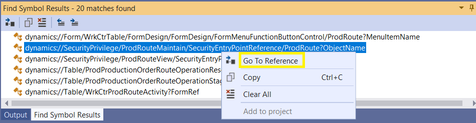
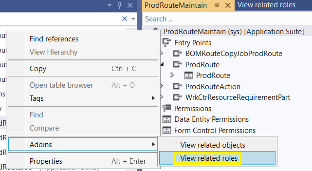
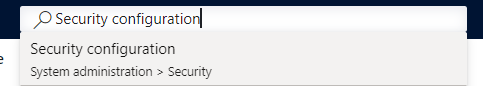
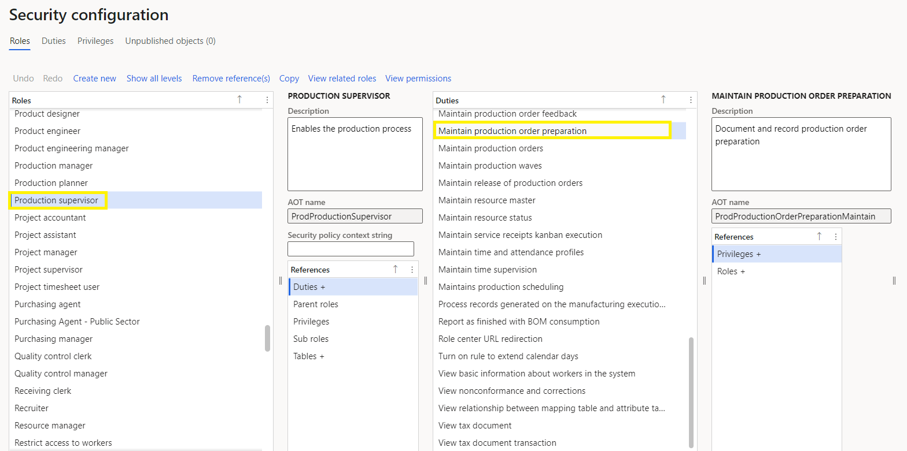

こんにちは、日本マイクロソフトの陳です。

この記事では、実際の使用例を基に、 Dynamics 365 for Finance and Operations の特定操作における必要なロールとライセンスをVisual Studioにて確認する方法についてご案内致します。

<!-- more -->

ユーザーにロールを付与する際に、使用したい機能に対して、異なるロールとライセンスが必要になります。
その際に、どのロールが必要かをVisual Studioにてご確認いただけます。
また、必要なロールを基にライセンスガイドにて必要なライセンスが記載されております。

例として、Production Route(生産工順)画面にてEdit、New、Delete操作を行いたい場合、必要なライセンスを確認する手順をご案内いたします。

---
## 手順
１．画面上の任意箇所を右クリックし、画面のForm Nameを確認します。

２．Cloud-hosted環境のVMにサインインし、Visual studioを開きます。 

３．Application Explorerを開き、ProdRouteで検索し、Menu itemsの中で[ProdRoute]があることを確認します。 

４．Menu itemsの[ProdRoute]を右クリックし、Find Referenceをクリックします。 

５．Referenceから以下2行のSecurityPrivilegeが参照されていることを確認します。ProdRouteMaintainを右クリックし、Go to Referenceをクリックします。 

６．ProdRouteMaintainの名前を右クリック> Addins > View related rolesをクリックします。

７．必要なロール、Duty、Privilegeを確認します。

８．最新のライセンスガイドにてProduction supervisorが必要なロールを確認します。SCMライセンスが必要です。
※ライセンスガイドにつきましては、以下のリンクからダウンロード頂けます。

https://go.microsoft.com/fwlink/p/?LinkId=866544

９．FOの画面上からSecurity configurationでも確認できます。

---
## おわりに  

以上、 Dynamics 365 for Finance and Operations の特定操作における必要なロールとライセンスをVisual Studioにて確認する方法についてご紹介させていただきました。

もし、お困りのこと等がございましたら、弊社までお問い合わせ頂きますようお願いいたします。
