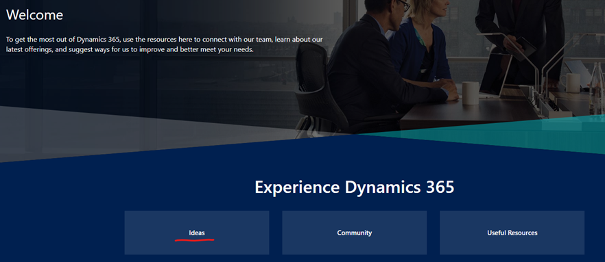
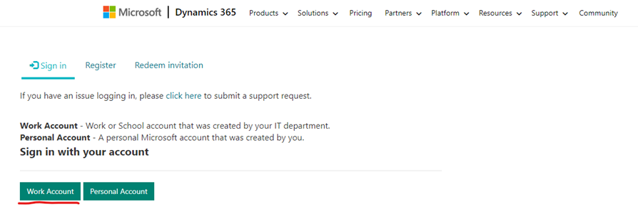
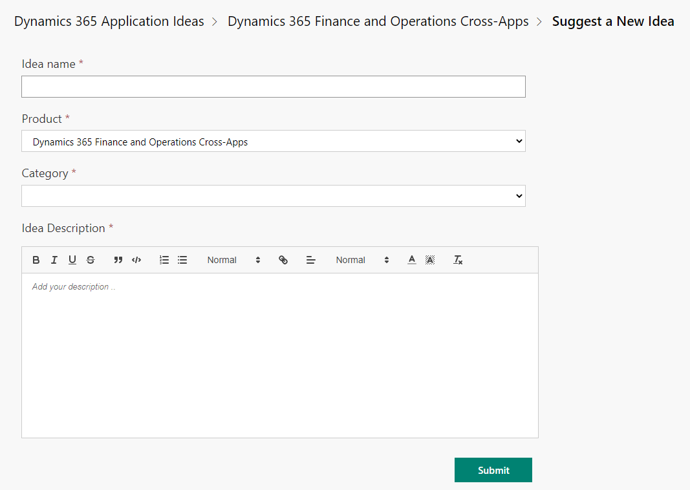

こんにちは、日本マイクロソフトの岡田です。
Dynamics 365 for Finance and Operations (またはその他の Dynamics 365 製品) を使用していく中で、もっと XX 機能がこうであったらいいのに、yy 機能に zz 機能を追加してほしい等、ユーザー様からご要望が出てくるかと思います(実際、そういったお問合せを弊社サポートで度々頂きます)。
この記事では、 そういったユーザー様からのご要望/製品フィードバックを承っている Ideas というサイトについてご紹介させていただきます。

<!-- more -->

Dynamics 365 for Finance and Operations やその他 Dynamics 365 製品に関する機能の改善や追加のリクエストにつきましては、Ideas で承っております。
Ideas に投稿された内容は、弊社開発部門に直接送付されます。**投稿への投票数が多い場合、多くのユーザー様からご要望の投稿であると判断させていただきまして、将来の製品の実装計画に含めるかどうか、検討をさせていただきます。**
Ideas の投稿手順、及び投稿への投票手順につきまして以下にご案内させていただきますので、是非 Ideas をご活用頂けますと幸いでございます。

## Ideas の投稿手順
(1) https://experience.dynamics.com/ を開きます。
(2) Ideas をクリックします。

(3) Suggest a new Idea をクリックします。

(4) Work Account をクリックします。

(5) Idea name, Product, Category, Idea Description を埋めて頂き、Submit ボタンをクリックします。

※ Product の入力項目につきましては、
   SCM 系の機能は、Dynamics 365 Supply Chain Management
   Finance 系の機能は、Dynamics 365 Finance
   それ以外の機能は、Dynamics 365 Finance and Operations Cross-Apps
   を選択ください。Product で選択した項目に応じて、Category で選択できる項目も変わります。
※ Idea name, Idea Description につきましては、英語で入力いただきます。

以上の手順を実施して頂くことで、Ideas への投稿が完了します。

## Ideas の投稿への投票手順
Ideas ページ右端の “Sign in” リンクをクリックし、MSアカウントなどでサインインいただき、[Vote] ボタンをクリックすることにより可能でございます。

---
## おわりに  
以上、 Ideas の投稿手順、及び投稿への投票手順をご紹介させていただきました。投稿内容に関するご不明点やご相談されたい事項がございましたら、お気兼ねなく弊社までお問合せ頂ければと思います。
