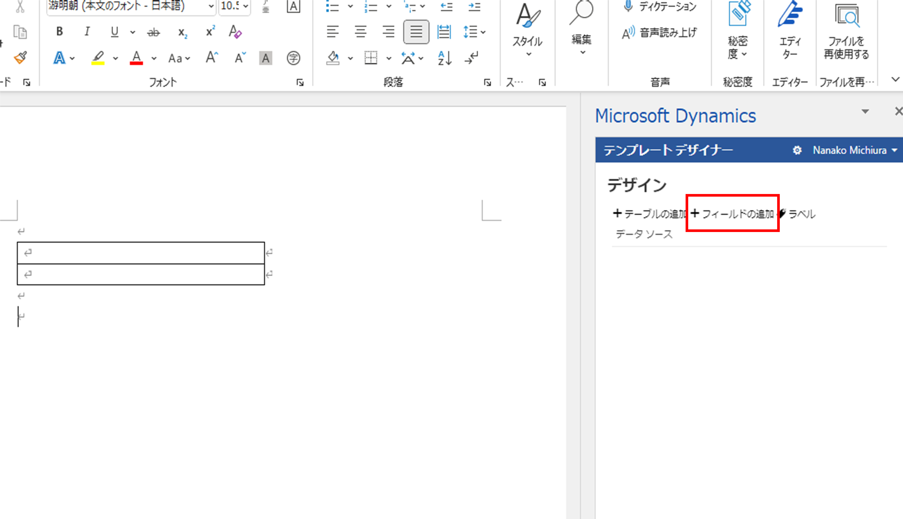
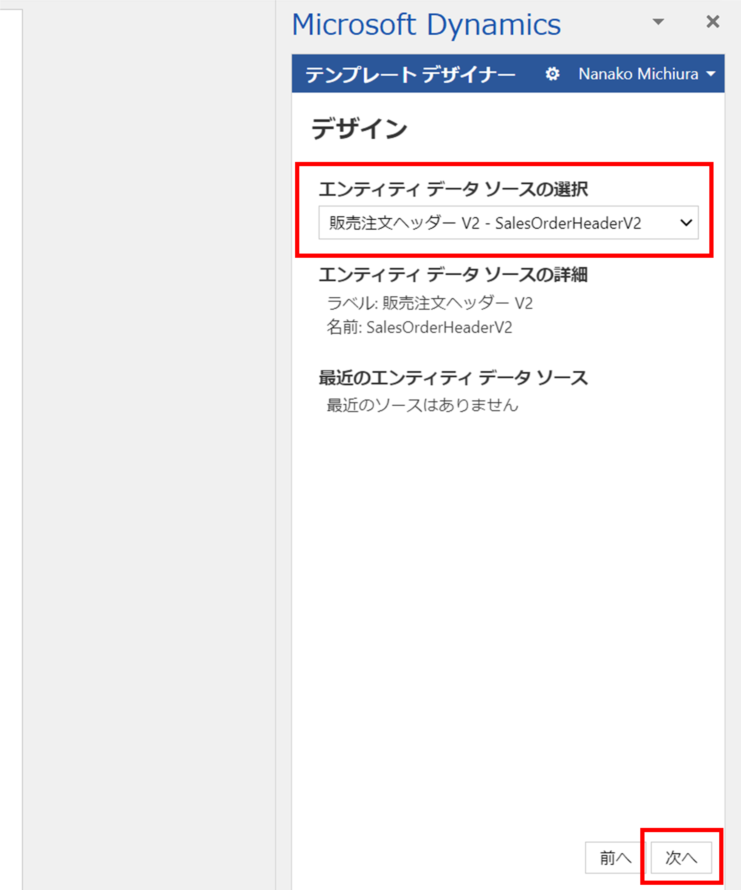
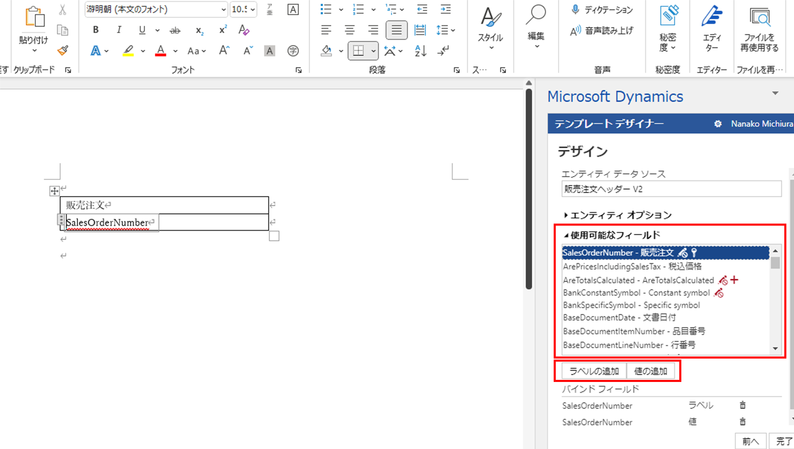
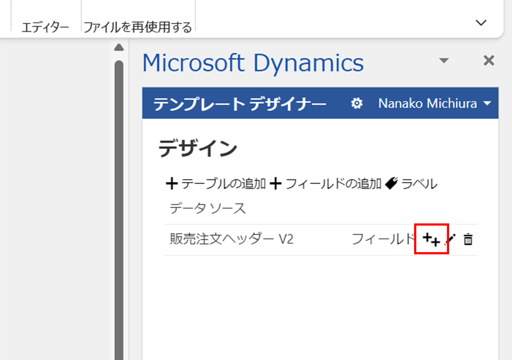
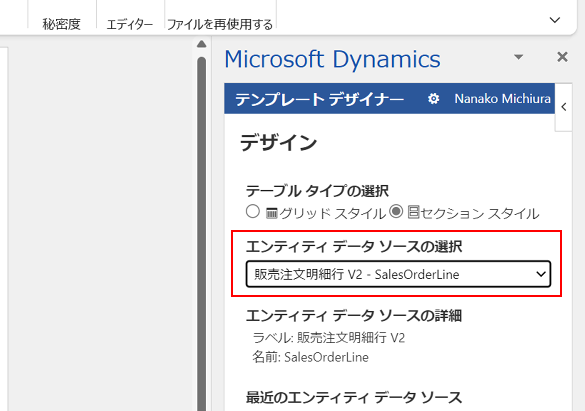
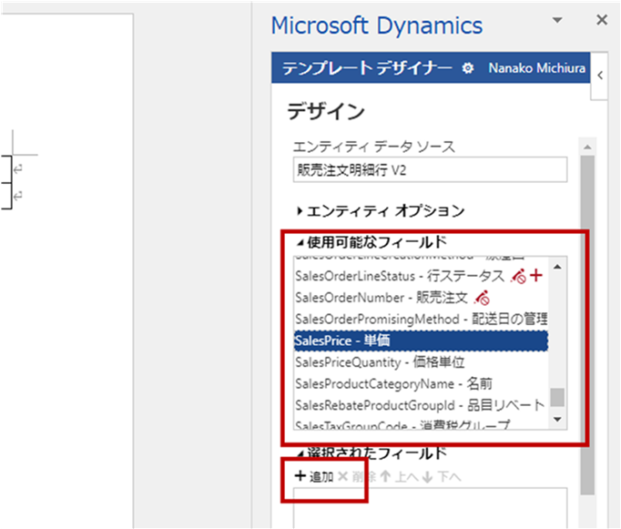
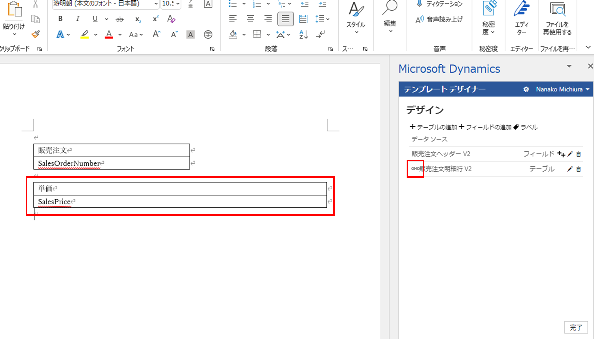

こんにちは、日本マイクロソフト Dynamics ERP サポートチームの道浦です。  
この記事では、 Dynamics 365 Finance and Operations にて、 Office 統合の Word テンプレートを用いる際に関連テーブルのリレーション設定で必要な手順を紹介します。

<!-- more -->
## 検証に用いた製品・バージョン
Dynamics 365 Finance and Operations      
Application version: 10.0.28    
Platform version: PU52  

## 事前準備
1. Word ファイルを新規作成する
2. 事前に使用するテンプレート (表など) を作成する
3. 作成したテンプレートに 「Microsoft Dynamics Office Add-in」 を追加する

## 関連テーブルのリレーション設定の手順

今回は、販売注文ヘッダーのフィールドにリンクした販売注文明細行を取得する方法を取り上げています。  

1. 追加したAdd-inを起動し、テンプレートデザイナーの「フィールドの追加」を選択します。
    

2. 「エンティティ データソースの選択」で「販売注文ヘッダー V2」を選択し、「次へ」をクリックします。
    

3. 用意した表の各項目に、「使用可能なフィールド」の中から必要なフィールドを選択します。  今回は「販売注文」のラベルと値を追加します。  
追加したフィールドは、左の表に自動的に記入されます。
    

4.  ヘッダーに紐づいた明細行の情報を取得するため、「フィールド」の横にある「++」ボタンをクリックします。
    

5. 「エンティティデータソースの選択」で「販売明細行」を選択します。
    

6. 「使用可能なフィールド」から追加するフィールドを選択し、「追加」ボタンをクリックします。  
今回は「単価」フィールドを追加します。
    

7. 追加したフィールドは、自動的にWordに追加されます。また、販売注文明細行の左側にリンクマークが表示されれば、注文ヘッダーにリンクした情報の取得が可能となります。    
今回の場合は、販売注文ヘッダーの「販売注文」とリンクした販売注文明細行の「単価」を取得することが可能です。
    

## 参考
作成したテンプレートを Dynamics 365 Finance and Operations にアップロードする方法は、公式ドキュメントにて公開されています。  
下記のリンクをご参照ください。  
https://docs.microsoft.com/ja-jp/dynamics365/fin-ops-core/dev-itpro/office-integration/office-integration-tutorial?context=%2Fdynamics365%2Fcontext%2Fcommerce

---
## おわりに  

以上、 Office 統合の Word テンプレートを用いる際に関連テーブルのリレーション設定で必要な手順についてご紹介しました。
より詳細な情報が必要な場合、弊社テクニカルサポート, Customer Success Account Manager (CSAM), Customer Engineer (CE) までお問い合わせください。
