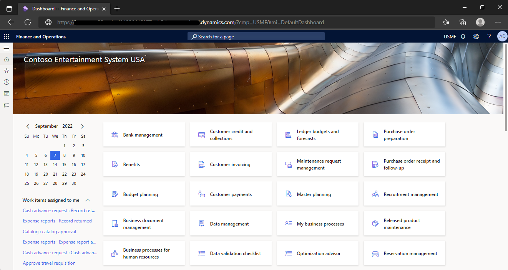
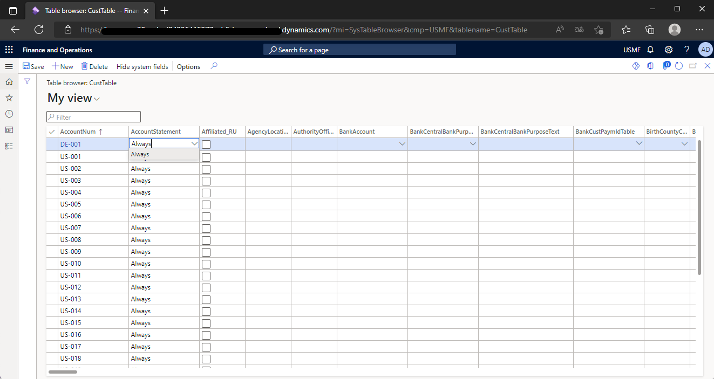

こんにちは、日本マイクロソフトの永吉です。  
この記事では、Dynamics 365 Finance and Operations の画面上で、データベースのテーブルデータを確認する方法を紹介します。

<!-- more -->
## 検証に用いた製品・バージョン:
Dynamics 365 Finance and Operations  
Application version: 10.0.28  
Platform version: PU52  

## はじめに
開発環境や本番環境など、環境ごとに参照権限・編集可否が異なります。  
本ブログでは UserID が Admin であることを前提に方法を紹介します。

## 手順
1. D365FO にブラウザでアクセスする
    
2. URL を以下のとおり変更する  
    ``` https://<environmentURL>/?mi=SysTableBrowser&cmp=<CompanyName>&tablename=<tablename> ```  
    以下例  
    
3. 画面上にリスト形式でテーブルデータが表示されます
    


## 注意
上記の手順、手順内の画像については本記事の執筆時のものです。
実際の画面とは挙動に違いがある可能性がございます。

---
## おわりに  

以上、Dynamics 365 Finance and Operations の画面上で、データベースのテーブルデータを確認する方法を紹介いたしました。  
もし、お困りのこと等がございましたら、弊社までお問い合わせ頂きますようお願いいたします。
