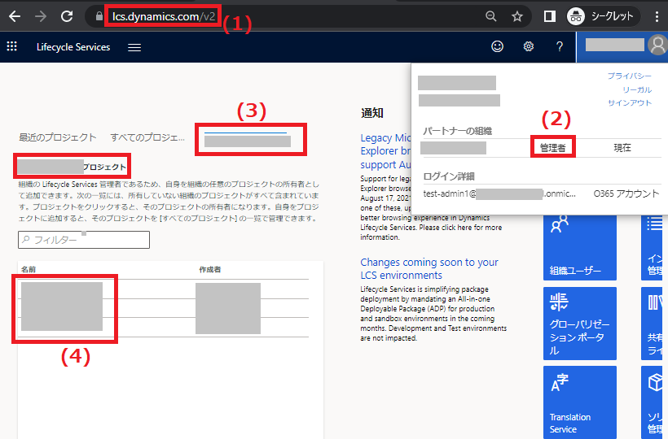
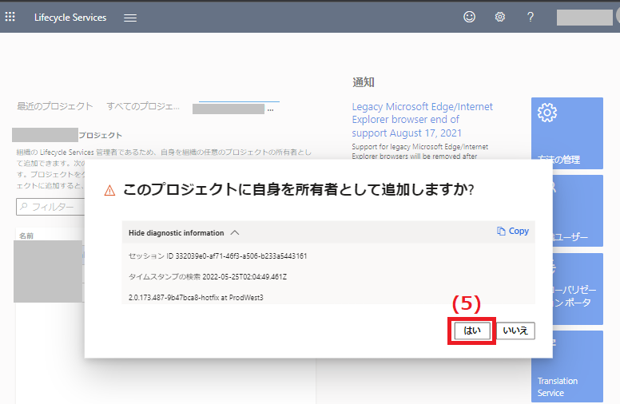
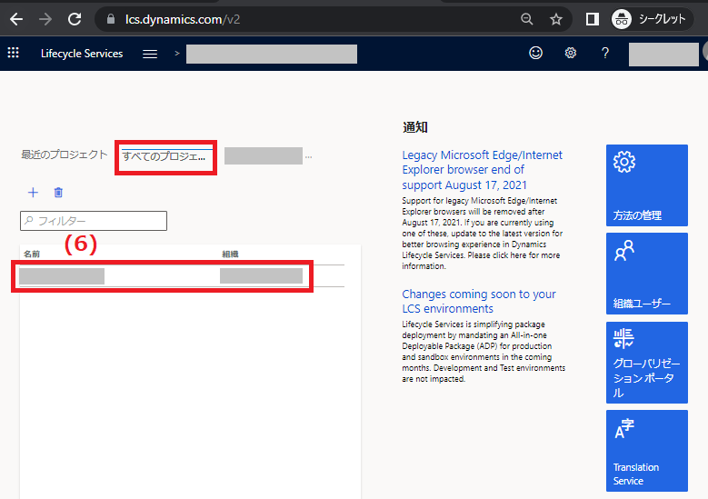

こんにちは、日本マイクロソフトの福原です。
この記事では、 Dynamics 365 for Finance and Operations のLCS (Lifecycle Services) プロジェクトにアクセスできるアカウントが見つからない場合の対処法についてご案内致します。

<!-- more -->

LCS プロジェクトにアクセスするためには、予めLCS プロジェクトにユーザーアカウントを登録して頂く必要がございます(*1)。
**しかし、テナント内に作成していたLCS プロジェクトに登録していたアカウントが見つからない/無効になった場合、既存のLCS プロジェクトに誰もアクセスできなくなることがございます。**
**その際には、テナントの管理者アカウント (グローバル管理者) をご使用して頂くことにより、LCS プロジェクトにアクセス権が無い状態でも、テナント管理者自身をそのLCS プロジェクトのプロジェクトオーナーに割り当てることが可能です。**
以下の手順により、テナント管理者自身をLCS プロジェクトのプロジェクトオーナーに割り当てましたら、他のユーザーアカウントをLCS プロジェクトのユーザーに追加することで、LCS プロジェクトの使用を再開することができます。

---
## 手順
(1) テナントの管理者アカウントにてhttps://lcs.dynamics.com/v2 にログインします。
(2) ページ右上のアカウントマークをクリックし、アカウントのタイプが管理者であることを確認します。
(3) "最近のプロジェクト"、"全てのプロジェクト"の隣に、組織名がありますので、そちらをクリックします。
(4) テナント内のLCS プロジェクトが表示されますので、所有者となりたいLCS プロジェクトを選択します。

(5) ポップアップウィンドウが表示されるので、自身を所有者として追加することに同意し、"はい"をクリックします。

(6) "すべてのプロジェクト"に、(4)のLCS プロジェクトが表示され、クリックすることで対象のLCS プロジェクトへアクセスできることを確認します。

以上の手順を実施して頂くことで、管理者アカウントがLCS プロジェクトにアクセスできるようになりましたら、LCS プロジェクトにユーザーアカウントを招待(*1)して頂くことが可能となります。

なお、以下の弊社公開資料でも一部同様の内容をご案内致しておりますのでご参考にして頂けますと幸いでございます。
https://docs.microsoft.com/ja-jp/dynamics365/fin-ops-core/dev-itpro/lifecycle-services/configure-lcs-security#organization-admin

*1: (LCS プロジェクトにユーザーアカウントを招待する方法) 
https://docs.microsoft.com/ja-jp/dynamics365/fin-ops-core/dev-itpro/lifecycle-services/configure-lcs-security#invite-a-user-to-an-lcs-project

---
## おわりに  

以上、 Dynamics 365 for Finance and Operations のLCS (Lifecycle Services) プロジェクトにアクセスできるアカウントが見つからない場合の対処法についてご紹介させていただきました。
もし、お困りのこと等がございましたら、弊社までお問い合わせ頂きますようお願いいたします。
