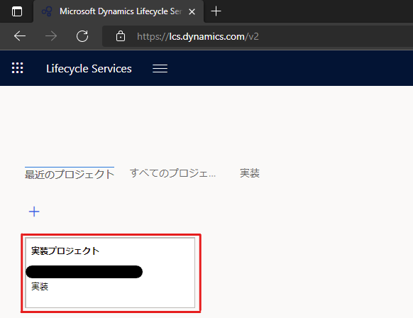
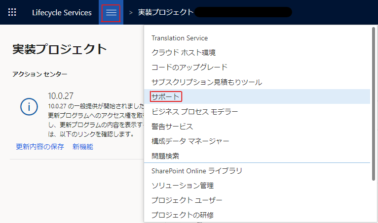
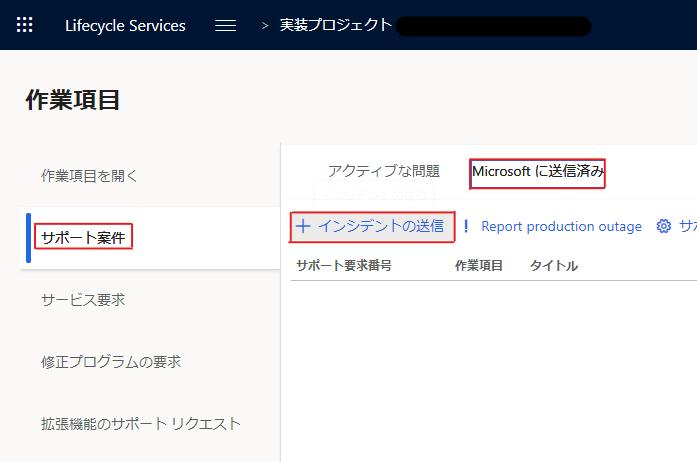
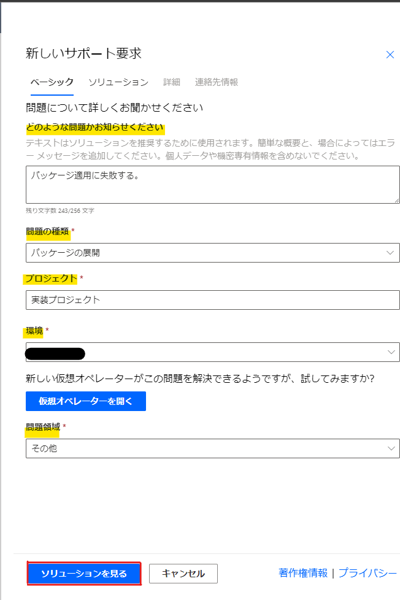
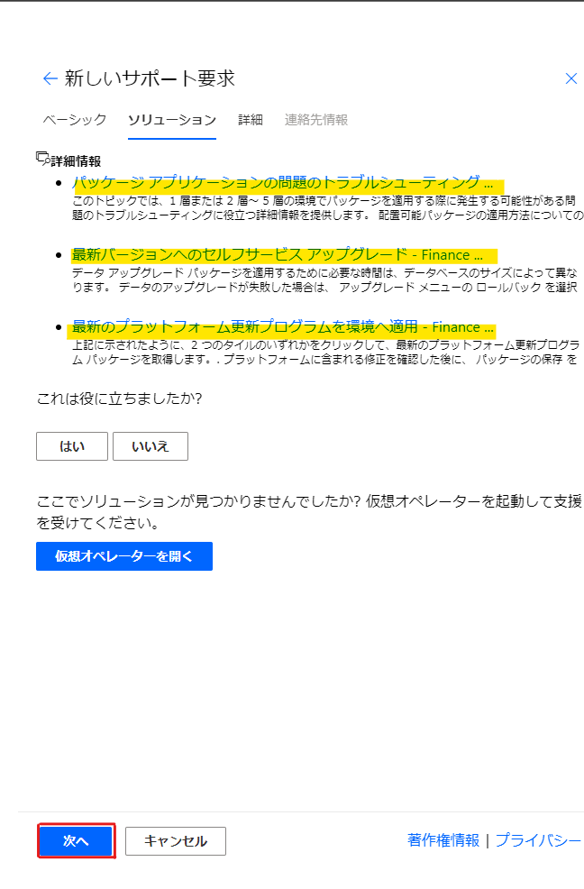
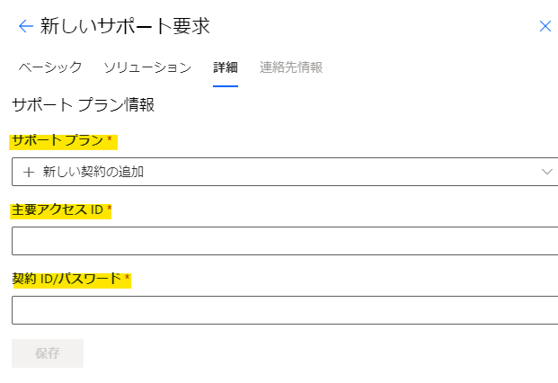
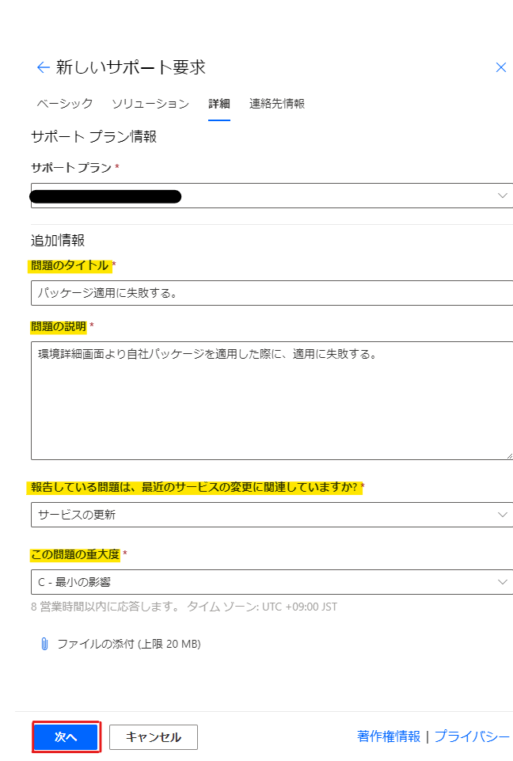

こんにちは、日本マイクロソフトの永吉です。

この記事では、LCSにてDynamics 365 Finance and Operationsに関するサポートリクエストを起票する方法を紹介します。
<!-- more -->

## 手順
1.  LCSにログインする
2.  サポートリクエストを起票したい環境の含まれているプロジェクトを選択する
    

3.  画面上部の三本線より、「サポート」を選択する
    

4.  画面左部より、「サポート案件」 > 「Microsoftに送信済み」 > 「インシデントの送信」を選択する
    

5.  画面右部に「新しいサポート要求」画面が表示されるので、各項目を入力・選択し、「ソリューションを見る」を選択する
    

6.  表示された詳細情報にて解決できない場合、「次へ」を選択する
    

7.  「サポートプラン情報」画面が表示されるので、サポートプランを選択する  
※ 主要アクセスIDおよび契約IDを持っていない場合、サポートプランにて ”Dynamics AX - Subscription” を選択いただくことで、サポートサービスを受けることができます。  
※ ”Dynamics AX - Subscription” を選択した場合、貴社サポート契約に紐づかない形でのサポートリクエストとなり、貴社にて有償サポート契約を持っていた場合でも、その契約に応じたサポートサービスを適切に受けられない可能性がございます。予めご了承ください。  
    

8.  サポートプランを選択後、追加情報を入力し、「次へ」を選択する  
※ 20 MB以上のファイルを添付したい場合、サポートリクエストでのやり取りにて、弊社よりファイルアップロードリンクを提供いたします。  
    

9.  「この要求に関する連絡先の情報」画面が表示されるので、国/地域、メールアドレス(TO, CC)、電話番号、希望の連絡方法を選択し、「送信」を選択する  
    

（関連情報）  
https://docs.microsoft.com/ja-jp/dynamics365/fin-ops-core/dev-itpro/lifecycle-services/cloud-powered-support-lcs#open-a-new-incident  
  
  
---
## おわりに  
