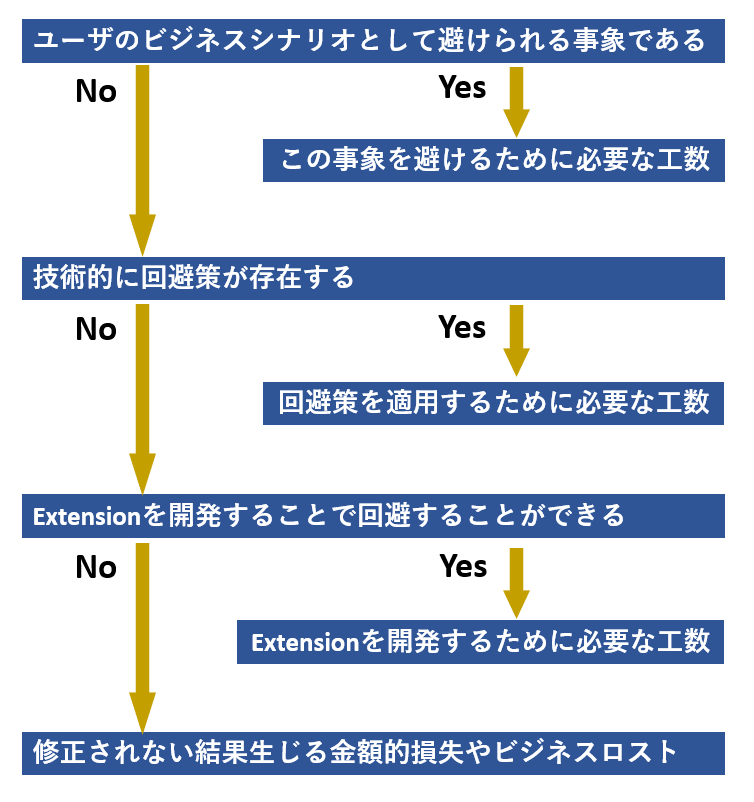

## はじめに
こんにちは、日本マイクロソフトの道浦です。
いつも Dynamics 365 Finance and Operations をご利用くださいまして、ありがとうございます。
この記事では、技術サポートにお問合せいただいている「お客様にて想定されていない事象」に対して、お客様の業務への影響度（以下ビジネスインパクト）をお伺いする目的や算出方法について解説させて頂きます。

<!-- more -->
## ビジネスインパクトをお伺いする目的
技術サポートでは日々、多くの事象をお客様よりお問い合わせいただいております。
その中で、同時に多数のお問い合わせをいただいた際に、各お客様の開発・運用状況などの背景をお伺いした上で緊急度を考慮し、順次対応させていただいております。  
具体的には、お客様の開発・運用状況などの背景を基にこの優先順位を判断いたします。

また、技術サポートでは回答が難しいお問い合わせの場合、弊社開発部門にエスカレーションし、協業して調査・対応を進めております。一方で、開発部門が対応の優先順位を決定する際には、「業務への影響度」を基準に優先順位を判断いたします。具体的には、その事象がお客様の業務にどれだけ影響を与えているのかを定量的に把握することで、世界中から報告いただいている事象の優先順位を決める指標の一つとしております。

下記に例を挙げさせて頂きます。  
【事象の比較】    
1. 事象 X
* 1 日に 1 人 1 回使用する機能 A が動作しない  
* 機能 A はエンドユーザー様 40 名が使用し、回避策を適用すると毎回 30 分余計な時間をロスする  

2. 事象 Y
* 1 ヶ月に 1 回使用する機能 B が動作しない  
* 機能 B はエンドユーザー様 10 名が使用し、回避策を適用すると毎回 10 分余計な時間をロスする  

上記例の場合、 2 つの事象のビジネスインパクトを比較し、事象 X を優先的に対応いたします。  
どの観点から見ても事象 X の方がビジネスインパクトが大きく見える例を出しましたが、具体的にはどういったビジネスインパクトを提供することで優先順位が定量的に決定されるかを紹介します。  

## ビジネスインパクトの種類
一言にビジネスインパクトと言っても、さまざまな種類があります。
今後お問い合わせいただく事象を以下のワークフローでご確認ください。  

  

## 事象を避けるための工数および回避策を適用するための工数の算出方法

[ 必要な情報 ]   
1. 1 回事象が発生時の業務への影響時間
2. 該当事象の発生頻度  
	※ 発生頻度 = 一人当たりの発生回数 × 該当者数
	

[ 工数の算出方法 ]   
* 一日数回程度発生する場合  
　　工数(〇時間/年) = 1回の対応に必要な時間(〇時間/回) x 発生頻度(〇回/日) x 240 (日/年)

* 月数回程度発生する場合  
　　工数(〇時間/年) = 1回の対応に必要な時間(〇時間/回) x 発生頻度(〇回/ヶ月) x 12 (ヶ月/年)  

* 年数回程度発生する場合  
　　工数(〇時間/年) = 1回の対応に必要な時間(〇時間/回) x 発生頻度(〇回/年) x 1 (年)  

この工数(〇時間/年)がビジネスインパクトになります。

## Extension を開発するために必要な工数について
こちらは、各会社間での契約状況に依りますので、開発見積もりの概算金額がビジネスインパクトになります。

## 修正されない結果生じる金額的損失やビジネスロストの算出について
ビジネスシナリオとして避けられず、技術的な回避策も存在せず、Extension 開発でも対応できない事象の場合、ビジネス自体に損害が発生します。  
よって、以下の観点より各項目で発生する金額的損失の概算がビジネスインパクトになります。

1. 対象のシナリオが停止・遅延することによって発生する金額的損失
2. 社会的信頼の失墜で将来的に発生する可能性があった売上等の金額的損失
3. 各種法律に反する結果となった場合に発生する金額的損失

## 算出したビジネスインパクトを提供しても期待した結果にならなかった場合

修正対応を希望していたが、提供したビジネスインパクトでは対応ができない・期限が約束できない、などと判断される場合もあります。その場合に、それ以上のビジネスインパクトを打ち出すために、Dynamics 製品では「Ideas」というサイトへの投稿・投票が有効な手段となります。

Ideas は、ユーザー様からのご要望/製品フィードバックを承っているサイトとなります。  
Ideas に投稿された内容は弊社開発部門に直接送付され、投票数に応じて今後の実装計画に含めるかどうかの検討をさせて頂いています。詳細は下記の URL にて、記載していますのでご参照ください。

https://jpdynamicserp.github.io/blog/D365FO%20Tech/how-to-post-ideas/

## おわりに
「お客様にて想定されていない事象」が発生した時、お客様が困っていることは重々承知しております。  
一方で、限られたリソースの中で正確な優先順位をつけるためにビジネスインパクトを定量的に把握する必要があります。  
迅速な解決を希望されている中でのご依頼であることは大変恐縮ではございますが、ご協力いただくことで緊急度を定量的に理解し対応をさせていただくことができます。  
私たち技術サポートも、お客様のビジネスインパクトの算出に助力いたしますので、どうぞよろしくお願いいたします。  
より詳細な情報が必要な場合、弊社テクニカルサポート、Customer Success Account Manager (CSAM), Customer Engineer (CE) までお問い合わせください。
