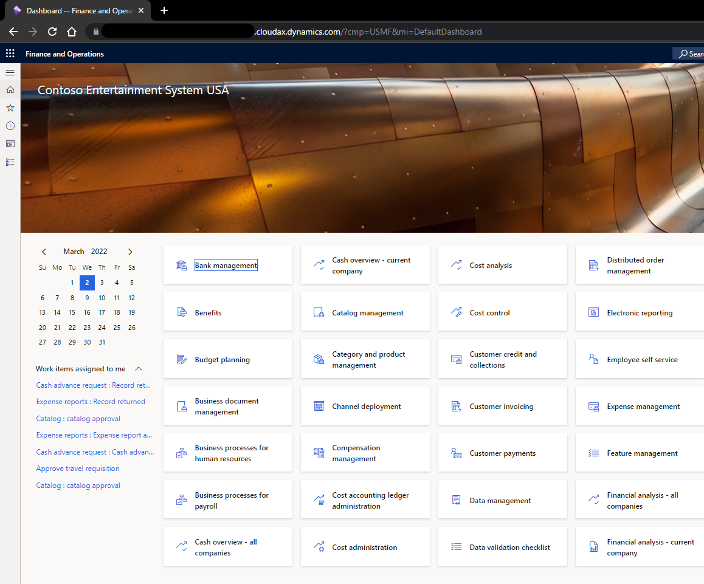

こんにちは、日本マイクロソフトの永吉です。

この記事では、Dynamics 365 Finance and Operationsにて、ユーザオプションの設定を変更せずに表示言語を変更する方法を紹介します。

# 手順
1. 環境のURLの最後に `&lng=表示したい言語` を追記する 
` (例) https://...operations.dynamics.com/?cmp=USMF&lng=ja`
2. ページをリフレッシュする（F5を押下）

# 対応している言語と指定方法
ユーザオプション > 基本設定 > 言語と国/地域の基本設定 > 言語にて設定できる言語をそのまま記載することで、その言語で表示することが可能です。
|言語|指定するコード|
|:-:|:-:|
|日本語|ja|
|英語（米国）|en-us|
|ドイツ語|de|
|中国語（簡体字）|zh-Hans|

# 実際の画面
 - 初期画面（英語（米国）表示）
 

 - 日本語に変更したときの画面（日本語表示）
 

 - ユーザオプションの設定値（en-usが設定されている）
 

---

異なる言語のお客様へデモンストレーションを予定している際や、サポートチームから英語での画面ショットの提供を依頼された際にご活用ください。
